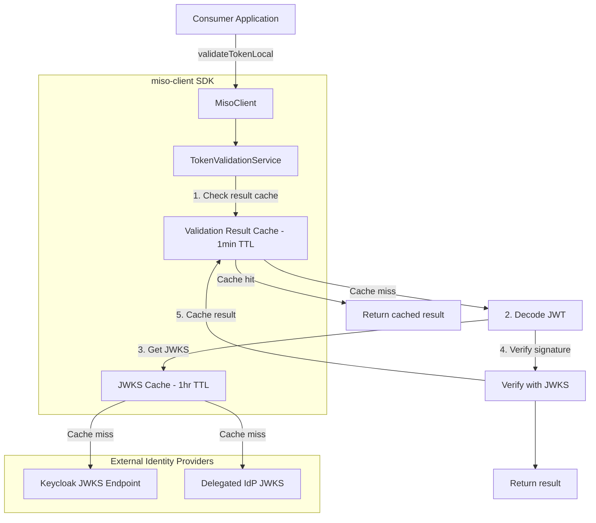

# Token Validation Migration to Local JWKS Validation

## Overview

Add `validateTokenLocal()` method to MisoClient that performs JWT validation using JWKS (JSON Web Key Set) fetched directly from identity providers (Keycloak or delegated OAuth providers). This eliminates the need for API calls to miso-controller for token validation.---

## Rules and Standards

This plan must comply with the following rules from [Project Rules](.cursor/rules/project-rules.mdc):

- **[Architecture Patterns - Service Layer](.cursor/rules/project-rules.mdc#service-layer)** - TokenValidationService follows service pattern with constructor dependencies
- **[Architecture Patterns - Token Management](.cursor/rules/project-rules.mdc#token-management)** - Token handling, caching, expiration tracking
- **[Code Style - TypeScript Conventions](.cursor/rules/project-rules.mdc#typescript-conventions)** - Strict mode, interfaces for public APIs, private methods
- **[Code Style - Naming Conventions](.cursor/rules/project-rules.mdc#naming-conventions)** - camelCase for all public API outputs
- **[Code Style - Error Handling](.cursor/rules/project-rules.mdc#error-handling)** - Try-catch for async, return appropriate defaults
- **[Testing Conventions](.cursor/rules/project-rules.mdc#testing-conventions)** - Jest, mock dependencies, 80%+ coverage
- **[Code Size Guidelines](.cursor/rules/project-rules.mdc#code-size-guidelines)** - Files under 500 lines, methods under 30 lines
- **[Security Guidelines](.cursor/rules/project-rules.mdc#security-guidelines)** - Never expose secrets, mask sensitive data
- **[Documentation](.cursor/rules/project-rules.mdc#documentation)** - JSDoc for public methods
- **[When Adding New Features](.cursor/rules/project-rules.mdc#when-adding-new-features)** - Types first, then service, then exports, then tests

**Key Requirements:**

- Services receive dependencies via constructor (TokenValidationService receives KeycloakConfig)
- All public API types use camelCase (TokenType, TokenPayload, KeycloakConfig, etc.)
- Return structured result objects on errors (not throw, not empty arrays)
- Use try-catch for all async operations
- Mock `jose` library in tests
- Keep TokenValidationService under 500 lines
- Add JSDoc comments for all public methods
- Never log tokens or sensitive payload data

**Note on JWT Handling:**The project rules state "use jsonwebtoken.decode() (not verify)". This plan intentionally introduces JWT **verification** using the `jose` library because:

1. The new feature requires cryptographic signature verification
2. JWKS provides the public keys needed for verification
3. This is a new capability, not a replacement of existing decode-only functionality
4. The existing `validateToken()` (API-based) remains unchanged for backward compatibility

---

## Before Development

- [ ] Read Architecture Patterns - Service Layer section from project-rules.mdc
- [ ] Review existing services for patterns (AuthService, RoleService, CacheService)
- [ ] Review error handling patterns in existing services
- [ ] Understand testing requirements and mock patterns from auth.service.test.ts
- [ ] Review JSDoc documentation patterns in existing services
- [ ] Review caching patterns (CacheService, Redis patterns)
- [ ] Verify jose library API: `jwtVerify`, `decodeJwt`, `createRemoteJWKSet`
- [ ] Check miso-client current version (3.1.2)
- [ ] Review MisoClientConfig interface for keycloak config placement

---

## Definition of Done

Before marking this plan as complete, ensure:

1. **Build**: Run `pnpm run build` FIRST (must complete successfully - TypeScript compilation)
2. **Lint**: Run `pnpm exec eslint src/services/token-validation.service.ts src/types/token-validation.types.ts` (zero errors/warnings)
3. **Test**: Run `pnpm test` AFTER lint (all tests pass, 80%+ coverage for new code)
4. **Validation Order**: BUILD -> LINT -> TEST (mandatory sequence, never skip steps)
5. **File Size Limits**: `token-validation.service.ts` under 500 lines, methods under 30 lines
6. **JSDoc Documentation**: All public methods have JSDoc comments with @param and @returns
7. **Code Quality**: All rule requirements met
8. **Security**: No tokens logged, no secrets exposed, proper error messages (no sensitive data)
9. **Error Handling**: Return structured `TokenValidationResult` on errors (never throw from public methods)
10. **Naming**: All public types use camelCase (TokenType, TokenPayload, KeycloakConfig, etc.)
11. **Exports**: New types and service exported from `src/index.ts`
12. **Documentation**: Update CHANGELOG.md with new features
13. All tasks completed
14. Service follows patterns from Architecture Patterns section
15. Tests mock `jose` library and cover cache hit/miss scenarios

---

## Current State

- `MisoClient.validateToken()` calls miso-controller API (`POST /api/v1/auth/validate`)
- No local JWKS validation capability
- Version: 3.1.2

## Target State

- New `MisoClient.validateTokenLocal()` performs local JWKS validation (no API call)
- Supports Keycloak tokens and delegated tokens (external OAuth providers)
- **Dual-layer caching:**
- JWKS keys: 1-hour TTL (keys change infrequently)
- Validation results: 1-minute TTL (reduces CPU overhead, accepts 1-min revocation delay)
- Backward compatible - existing `validateToken()` unchanged
- Version: 3.3.0

---

## Architecture




## Caching Strategy

| Cache Layer | TTL | Key Format | Purpose ||-------------|-----|------------|---------|| JWKS Keys | 1 hour | `jwksUri` | Reduce network calls to IdP || Validation Results | 1 minute | `tokenHash` (first 16 + last 16 chars) | Reduce CPU overhead of signature verification |**Security Note:** 1-minute validation cache means revoked tokens may be accepted for up to 1 minute. This is acceptable for most applications but can be disabled via `skipResultCache: true` option.---

## Implementation Tasks

### 1. Add jose Dependency

Update [`package.json`](package.json):

```json
{
  "dependencies": {
    "jose": "^5.9.6"
  }
}
```

Run `pnpm install` after updating.---

### 2. Create Token Validation Types

Create [`src/types/token-validation.types.ts`](src/types/token-validation.types.ts):**Requirements:**

- All property names in camelCase (per naming conventions)
- Use interfaces for public types (per TypeScript conventions)
- Export from `src/index.ts`
```typescript
/**
    * Token validation types for local JWKS-based JWT verification
    * @module token-validation.types
 */

import { JWTPayload } from 'jose';

/** Token type for validation routing */
export type TokenType = 'keycloak' | 'delegated' | 'auto';

/** Keycloak server configuration for local token validation */
export interface KeycloakConfig {
  /** Keycloak server URL (e.g., "https://keycloak.example.com") */
  authServerUrl: string;
  /** Keycloak realm name */
  realm: string;
  /** Client ID for audience validation (optional) */
  clientId?: string;
  /** Client secret for confidential clients (optional) */
  clientSecret?: string;
  /** Enable audience validation (default: false) */
  verifyAudience?: boolean;
}

/** Configuration for delegated OAuth providers */
export interface DelegatedProviderConfig {
  /** Provider identifier (e.g., "google", "github") */
  key: string;
  /** Expected issuer claim value */
  issuer: string;
  /** JWKS endpoint URL */
  jwksUri: string;
  /** Expected audience (optional) */
  audience?: string;
}

/** Function to look up delegated provider by issuer */
export type DelegatedProviderLookup = (
  issuer: string
) => Promise<DelegatedProviderConfig | null>;

/** Options for token validation */
export interface TokenValidationOptions {
  /** Force token type detection */
  tokenType?: TokenType;
  /** Delegated provider config or lookup function */
  delegatedProvider?: DelegatedProviderConfig | DelegatedProviderLookup;
  /** Skip audience validation */
  skipAudienceValidation?: boolean;
  /** Skip validation result cache (for high-security scenarios) */
  skipResultCache?: boolean;
}

/** Result of token validation */
export interface TokenValidationResult {
  /** Whether token is valid */
  valid: boolean;
  /** Detected or specified token type */
  tokenType: TokenType;
  /** Decoded token payload (if valid) */
  payload?: TokenPayload;
  /** Error message (if invalid) */
  error?: string;
  /** Provider key for delegated tokens */
  providerKey?: string;
  /** True if result came from cache */
  cached?: boolean;
}

/** JWT payload with common claims */
export interface TokenPayload extends JWTPayload {
  /** Subject (user ID) */
  sub: string;
  /** Issuer */
  iss: string;
  /** User email (optional) */
  email?: string;
  /** Preferred username (optional) */
  preferredUsername?: string;
  /** Display name (optional) */
  name?: string;
  /** Keycloak realm roles (optional) */
  realmAccess?: { roles: string[] };
  /** Keycloak resource/client roles (optional) */
  resourceAccess?: Record<string, { roles: string[] }>;
}

/** Internal cache entry for validation results */
export interface ValidationCacheEntry {
  /** Cached result */
  result: TokenValidationResult;
  /** Expiration timestamp */
  expiresAt: number;
}
```


---

### 3. Create Token Validation Service

Create [`src/services/token-validation.service.ts`](src/services/token-validation.service.ts):**Requirements:**

- Under 500 lines
- Methods under 30 lines
- JSDoc for all public methods
- Try-catch for all async operations
- Return `TokenValidationResult` on errors (never throw)
```typescript
/**
    * Token validation service for local JWKS-based JWT verification
    * Supports Keycloak and delegated OAuth providers with dual-layer caching
 */

import { jwtVerify, decodeJwt, createRemoteJWKSet, JWTVerifyGetKey } from 'jose';
import {
  TokenType,
  TokenValidationOptions,
  TokenValidationResult,
  TokenPayload,
  KeycloakConfig,
  DelegatedProviderConfig,
  ValidationCacheEntry,
} from '../types/token-validation.types';

export class TokenValidationService {
  // JWKS cache: jwksUri -> { keySet, expiresAt }
  private jwksCache = new Map<string, { keySet: JWTVerifyGetKey; expiresAt: number }>();
  private readonly JWKS_CACHE_TTL_MS = 60 * 60 * 1000; // 1 hour

  // Validation result cache: tokenHash -> { result, expiresAt }
  private resultCache = new Map<string, ValidationCacheEntry>();
  private readonly RESULT_CACHE_TTL_MS = 60 * 1000; // 1 minute

  private keycloakConfig?: KeycloakConfig;

  constructor(keycloakConfig?: KeycloakConfig) {
    this.keycloakConfig = keycloakConfig;
  }

  /**
            * Set or update Keycloak configuration
            * @param config - Keycloak configuration
   */
  setKeycloakConfig(config: KeycloakConfig): void {
    this.keycloakConfig = config;
  }

  /**
            * Validate token locally using JWKS
            * @param token - JWT token to validate
            * @param options - Validation options
            * @returns Validation result with payload or error
   */
  async validateTokenLocal(
    token: string,
    options?: TokenValidationOptions
  ): Promise<TokenValidationResult> {
    try {
      // 1. Check validation result cache (unless skipResultCache)
      if (!options?.skipResultCache) {
        const cached = this.getCachedResult(token);
        if (cached) {
          return { ...cached, cached: true };
        }
      }

      // 2. Perform actual validation
      const result = await this.performValidation(token, options);

      // 3. Cache result (unless skipResultCache or shouldn't cache)
      if (!options?.skipResultCache && this.shouldCacheResult(result)) {
        this.cacheResult(token, result);
      }

      return result;
    } catch (error) {
      const errorMessage = error instanceof Error ? error.message : 'Token validation failed';
      return {
        valid: false,
        tokenType: options?.tokenType || 'auto',
        error: errorMessage,
      };
    }
  }

  /**
            * Clear JWKS cache
            * @param jwksUri - Specific URI to clear, or all if not provided
   */
  clearCache(jwksUri?: string): void {
    if (jwksUri) {
      this.jwksCache.delete(jwksUri);
    } else {
      this.jwksCache.clear();
    }
  }

  /**
            * Clear validation result cache
   */
  clearResultCache(): void {
    this.resultCache.clear();
  }

  /**
            * Clear all caches (JWKS + results)
   */
  clearAllCaches(): void {
    this.jwksCache.clear();
    this.resultCache.clear();
  }

  // ==================== PRIVATE METHODS ====================

  private async performValidation(
    token: string,
    options?: TokenValidationOptions
  ): Promise<TokenValidationResult> {
    // Decode to get issuer (without verification)
    const decoded = decodeJwt(token);
    const issuer = decoded.iss;

    if (!issuer) {
      return { valid: false, tokenType: 'auto', error: 'Token missing issuer (iss) claim' };
    }

    const tokenType = this.determineTokenType(issuer, options?.tokenType);

    if (tokenType === 'keycloak') {
      return this.validateKeycloakToken(token, issuer, options);
    } else {
      return this.validateDelegatedToken(token, issuer, options);
    }
  }

  private determineTokenType(issuer: string, hint?: TokenType): TokenType {
    if (hint && hint !== 'auto') return hint;

    if (this.keycloakConfig) {
      const keycloakIssuer = `${this.keycloakConfig.authServerUrl}/realms/${this.keycloakConfig.realm}`;
      if (issuer === keycloakIssuer) return 'keycloak';
    }

    return 'delegated';
  }

  private async validateKeycloakToken(
    token: string,
    issuer: string,
    options?: TokenValidationOptions
  ): Promise<TokenValidationResult> {
    if (!this.keycloakConfig) {
      return { valid: false, tokenType: 'keycloak', error: 'Keycloak not configured' };
    }

    const jwksUri = `${this.keycloakConfig.authServerUrl}/realms/${this.keycloakConfig.realm}/protocol/openid-connect/certs`;
    const expectedIssuer = `${this.keycloakConfig.authServerUrl}/realms/${this.keycloakConfig.realm}`;

    try {
      const jwks = await this.getJWKS(jwksUri);
      const verifyOptions: { issuer: string; audience?: string } = { issuer: expectedIssuer };
      
      if (this.keycloakConfig.verifyAudience && this.keycloakConfig.clientId) {
        verifyOptions.audience = this.keycloakConfig.clientId;
      }

      const { payload } = await jwtVerify(token, jwks, verifyOptions);

      return {
        valid: true,
        tokenType: 'keycloak',
        payload: this.mapPayload(payload),
      };
    } catch (error) {
      return {
        valid: false,
        tokenType: 'keycloak',
        error: error instanceof Error ? error.message : 'Keycloak token validation failed',
      };
    }
  }

  private async validateDelegatedToken(
    token: string,
    issuer: string,
    options?: TokenValidationOptions
  ): Promise<TokenValidationResult> {
    let provider: DelegatedProviderConfig | null = null;

    if (typeof options?.delegatedProvider === 'function') {
      provider = await options.delegatedProvider(issuer);
    } else if (options?.delegatedProvider) {
      provider = options.delegatedProvider;
    }

    if (!provider) {
      return {
        valid: false,
        tokenType: 'delegated',
        error: `No delegated provider configured for issuer: ${issuer}`,
      };
    }

    try {
      const jwks = await this.getJWKS(provider.jwksUri);
      const verifyOptions: { issuer: string; audience?: string } = { issuer: provider.issuer };

      if (!options?.skipAudienceValidation && provider.audience) {
        verifyOptions.audience = provider.audience;
      }

      const { payload } = await jwtVerify(token, jwks, verifyOptions);

      return {
        valid: true,
        tokenType: 'delegated',
        providerKey: provider.key,
        payload: this.mapPayload(payload),
      };
    } catch (error) {
      return {
        valid: false,
        tokenType: 'delegated',
        providerKey: provider.key,
        error: error instanceof Error ? error.message : 'Delegated token validation failed',
      };
    }
  }

  private mapPayload(payload: Record<string, unknown>): TokenPayload {
    return {
      ...payload,
      sub: payload.sub as string,
      iss: payload.iss as string,
      email: payload.email as string | undefined,
      preferredUsername: payload.preferred_username as string | undefined,
      name: payload.name as string | undefined,
      realmAccess: payload.realm_access as { roles: string[] } | undefined,
      resourceAccess: payload.resource_access as Record<string, { roles: string[] }> | undefined,
    };
  }

  private async getJWKS(jwksUri: string): Promise<JWTVerifyGetKey> {
    const cached = this.jwksCache.get(jwksUri);
    if (cached && cached.expiresAt > Date.now()) {
      return cached.keySet;
    }

    const keySet = createRemoteJWKSet(new URL(jwksUri));
    this.jwksCache.set(jwksUri, {
      keySet,
      expiresAt: Date.now() + this.JWKS_CACHE_TTL_MS,
    });

    return keySet;
  }

  private getTokenHash(token: string): string {
    // Use first 16 + last 16 chars as pseudo-hash for cache key
    if (token.length <= 32) return token;
    return `${token.slice(0, 16)}...${token.slice(-16)}`;
  }

  private getCachedResult(token: string): TokenValidationResult | null {
    const hash = this.getTokenHash(token);
    const entry = this.resultCache.get(hash);
    
    if (entry && entry.expiresAt > Date.now()) {
      return entry.result;
    }
    
    // Clean up expired entry
    if (entry) {
      this.resultCache.delete(hash);
    }
    
    return null;
  }

  private cacheResult(token: string, result: TokenValidationResult): void {
    const hash = this.getTokenHash(token);
    this.resultCache.set(hash, {
      result,
      expiresAt: Date.now() + this.RESULT_CACHE_TTL_MS,
    });
  }

  private shouldCacheResult(result: TokenValidationResult): boolean {
    // Cache valid results and definitive invalid results
    // Don't cache config errors (provider not found, etc.)
    if (result.valid) return true;
    if (result.error?.includes('expired')) return true;
    if (result.error?.includes('signature')) return true;
    if (result.error?.includes('invalid')) return true;
    return false;
  }
}
```


---

### 4. Update MisoClientConfig

Update [`src/types/config.types.ts`](src/types/config.types.ts) - add keycloak config after line 110:

```typescript
  // Optional: Keycloak configuration for local token validation
  keycloak?: {
    authServerUrl: string;
    realm: string;
    clientId?: string;
    clientSecret?: string;
    verifyAudience?: boolean;
  };
```

---

### 5. Update MisoClient Class

Update [`src/index.ts`](src/index.ts):**Add imports (after line 14):**

```typescript
import { TokenValidationService } from './services/token-validation.service';
import {
  TokenValidationOptions,
  TokenValidationResult,
  KeycloakConfig,
} from './types/token-validation.types';
```

**Add property (after line 27):**

```typescript
private tokenValidation: TokenValidationService;
```

**Add initialization in constructor (after line 71):**

```typescript
// Initialize token validation service
this.tokenValidation = new TokenValidationService(config.keycloak);
```

**Add new methods (after line 226, in AUTHENTICATION METHODS section):**

```typescript
  /**
            * Validate token locally using JWKS (no API call to controller)
            * Results are cached for 1 minute, JWKS keys cached for 1 hour
            * @param token - JWT token to validate
            * @param options - Validation options (skipResultCache for high-security)
            * @returns Validation result with payload or error
   */
  async validateTokenLocal(
    token: string,
    options?: TokenValidationOptions
  ): Promise<TokenValidationResult> {
    return this.tokenValidation.validateTokenLocal(token, options);
  }

  /**
            * Set or update Keycloak configuration for local validation
            * @param config - Keycloak configuration
   */
  setKeycloakConfig(config: KeycloakConfig): void {
    this.tokenValidation.setKeycloakConfig(config);
  }

  /**
            * Clear JWKS cache (useful for key rotation scenarios)
            * @param jwksUri - Specific URI to clear, or all if not provided
   */
  clearJwksCache(jwksUri?: string): void {
    this.tokenValidation.clearCache(jwksUri);
  }

  /**
            * Clear validation result cache
   */
  clearValidationCache(): void {
    this.tokenValidation.clearResultCache();
  }

  /**
            * Clear all token validation caches (JWKS + results)
   */
  clearAllTokenCaches(): void {
    this.tokenValidation.clearAllCaches();
  }
```

---

### 6. Export New Types and Service

Update [`src/index.ts`](src/index.ts) exports (after line 498):

```typescript
// Token validation types (v3.3.0+)
export type {
  TokenType,
  TokenValidationOptions,
  TokenValidationResult,
  TokenPayload,
  KeycloakConfig,
  DelegatedProviderConfig,
  DelegatedProviderLookup,
} from './types/token-validation.types';

// Token validation service (for advanced usage)
export { TokenValidationService } from './services/token-validation.service';
```

---

### 7. Add Unit Tests

Create [`tests/unit/token-validation.service.test.ts`](tests/unit/token-validation.service.test.ts):**Test Structure:**

```typescript
/**
    * Unit tests for TokenValidationService
 */

import { TokenValidationService } from '../../src/services/token-validation.service';
import { KeycloakConfig, DelegatedProviderConfig } from '../../src/types/token-validation.types';

// Mock jose library
jest.mock('jose', () => ({
  jwtVerify: jest.fn(),
  decodeJwt: jest.fn(),
  createRemoteJWKSet: jest.fn(),
}));

const jose = require('jose');

describe('TokenValidationService', () => {
  let service: TokenValidationService;
  const keycloakConfig: KeycloakConfig = {
    authServerUrl: 'https://keycloak.example.com',
    realm: 'test-realm',
    clientId: 'test-client',
  };

  beforeEach(() => {
    jest.clearAllMocks();
    service = new TokenValidationService(keycloakConfig);
  });

  describe('validateTokenLocal', () => {
    // Keycloak validation tests
    // Delegated validation tests
    // Error handling tests
  });

  describe('Result Cache', () => {
    // Cache hit tests
    // Cache miss tests
    // Cache expiration tests
    // skipResultCache tests
    // clearResultCache tests
  });

  describe('JWKS Cache', () => {
    // Cache hit/miss tests
    // clearCache tests
  });

  describe('clearAllCaches', () => {
    // Combined cache clearing tests
  });
});
```

**Required Test Cases:**

- Keycloak token validation (valid token)
- Keycloak token validation (expired token)
- Keycloak token validation (invalid signature)
- Keycloak not configured error
- Delegated token validation with static config
- Delegated token validation with lookup function
- Unknown issuer handling
- Missing issuer claim handling
- Cache hit returns cached result with `cached: true`
- Cache miss performs full validation
- Expired cache entries are evicted
- `skipResultCache: true` bypasses cache
- `clearResultCache()` clears all entries
- Valid results are cached
- Expired token results are cached
- Config errors are NOT cached
- JWKS cache hit/miss scenarios
- `clearCache(uri)` clears specific entry
- `clearCache()` clears all entries
- `clearAllCaches()` clears both caches

---

### 8. Version Bump and Changelog

Update [`package.json`](package.json) version to `"3.3.0"`.Update [`CHANGELOG.md`](CHANGELOG.md):

```markdown
## [3.3.0] - 2025-12-XX

### Added

- **Local Token Validation** - JWKS-based JWT validation without API calls
        - New `validateTokenLocal()` method for local JWT signature verification
        - Supports Keycloak tokens and delegated OAuth provider tokens
        - Dual-layer caching: JWKS keys (1 hour) + validation results (1 minute)
        - `skipResultCache` option for high-security scenarios
        - Auto-detection of token type based on issuer claim
        - New `TokenValidationService` exported for advanced usage

- **Keycloak Configuration** - Native Keycloak integration
        - New `keycloak` config option in `MisoClientConfig`
        - `setKeycloakConfig()` method for runtime configuration
        - Audience validation support (opt-in via `verifyAudience`)

- **Cache Management** - Fine-grained cache control
        - `clearJwksCache(uri?)` - Clear JWKS key cache
        - `clearValidationCache()` - Clear validation result cache
        - `clearAllTokenCaches()` - Clear all caches

### Dependencies

- Added `jose` ^5.9.6 for JWT/JWKS operations
```

---

## Files Summary

| File | Action ||------|--------|| `package.json` | Add jose ^5.9.6, bump to 3.3.0 || `src/types/token-validation.types.ts` | Create (new file) || `src/services/token-validation.service.ts` | Create (new file, ~250 lines) || `src/types/config.types.ts` | Add keycloak config (~6 lines) || `src/index.ts` | Add imports, property, methods, exports (~50 lines) || `tests/unit/token-validation.service.test.ts` | Create (new file, ~300 lines) || `CHANGELOG.md` | Document new features |---

## Usage Examples

### Basic Usage (with result caching)

```typescript
import { MisoClient, loadConfig } from '@aifabrix/miso-client';

const client = new MisoClient({
  ...loadConfig(),
  keycloak: {
    authServerUrl: 'https://keycloak.example.com',
    realm: 'master',
  },
});

const result = await client.validateTokenLocal(token);
// First call: performs validation, caches result
// Subsequent calls within 1 minute: returns cached result

if (result.valid) {
  console.log('User:', result.payload?.sub);
  console.log('From cache:', result.cached); // true if cached
}
```


### High-Security Mode (skip cache)

```typescript
// Always perform fresh validation (no 1-minute delay for revoked tokens)
const result = await client.validateTokenLocal(token, {
  skipResultCache: true,
});
```


### Delegated Provider Validation

```typescript
const result = await client.validateTokenLocal(token, {
  tokenType: 'delegated',
  delegatedProvider: {
    key: 'google',
    issuer: 'https://accounts.google.com',
    jwksUri: 'https://www.googleapis.com/oauth2/v3/certs',
  },
});
```


### Dynamic Provider Lookup

```typescript
const result = await client.validateTokenLocal(token, {
  delegatedProvider: async (issuer) => {
    const provider = await db.providers.findByIssuer(issuer);
    if (!provider) return null;
    return {
      key: provider.key,
      issuer: provider.issuer,
      jwksUri: provider.jwksUri,
    };
  },
});
```


### Cache Management

```typescript
// Clear validation result cache (e.g., after token revocation)
client.clearValidationCache();

// Clear JWKS cache (e.g., after key rotation)
client.clearJwksCache();

// Clear specific JWKS URI
client.clearJwksCache('https://keycloak.example.com/realms/master/protocol/openid-connect/certs');

// Clear everything
client.clearAllTokenCaches();
```

---

## Plan Validation Report

**Date**: 2025-12-22**Plan**: Token Validation Migration**Status**: VALIDATED

### Plan Purpose

Add local JWKS-based JWT validation with dual-layer caching (JWKS 1hr, results 1min) to reduce API calls and improve performance. Affects: new service, types, MisoClient integration.

### Applicable Rules

- Architecture Patterns - Service Layer: Service constructor pattern
- Architecture Patterns - Token Management: Token caching, expiration
- Code Style - TypeScript/Naming/Error Handling: Strict mode, camelCase, try-catch
- Testing Conventions: Jest, mocking, 80%+ coverage
- Code Size Guidelines: Files under 500 lines
- Security Guidelines: Never log tokens
- Documentation: JSDoc for public methods

### Rule Compliance

- DoD Requirements: Documented (BUILD -> LINT -> TEST)
- Service Pattern: Compliant (constructor with config)
- Error Handling: Compliant (return result, never throw)
- Naming: Compliant (all camelCase)
- Testing: Requirements documented
- Security: Requirements documented

### Plan Updates Made

- Added Rules and Standards section with rule links
- Added Before Development checklist
- Enhanced Definition of Done with all requirements