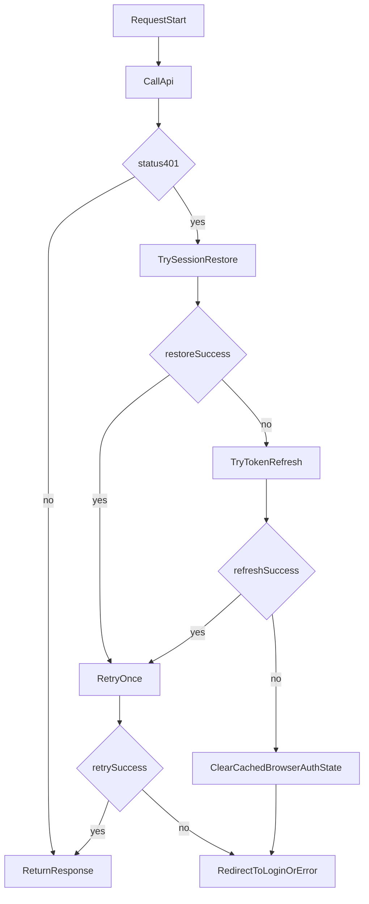

# 57 Enterprise Auth Unification for TypeScript SDK

## Goal

Deliver the `aifabrix-miso-client` part of enterprise auth unification from [`/workspace/aifabrix-miso/.cursor/plans/177-enterprise-auth-unification_b61e0744.plan.md`](/workspace/aifabrix-miso/.cursor/plans/177-enterprise-auth-unification_b61e0744.plan.md), reusing behavioral contracts already extracted to Python in [`/workspace/aifabrix-miso-client-python/.cursor/plans/43_enterprise_auth_extraction_3e84b2d5.plan.md`](/workspace/aifabrix-miso-client-python/.cursor/plans/43_enterprise_auth_extraction_3e84b2d5.plan.md) and validated against Dataplane baseline in [`/workspace/aifabrix-dataplane/.cursor/plans/384-enterprise-auth-unification_d5c96fa8.plan.md`](/workspace/aifabrix-dataplane/.cursor/plans/384-enterprise-auth-unification_d5c96fa8.plan.md).

## Scope Boundaries

- Keep existing SDK capabilities (`refreshToken`, `onTokenRefresh`, 401 retry) and extend them with missing enterprise-auth primitives.
- Implement browser-safe auth utilities in SDK (token lifecycle math, storage compatibility, session restore/refresh orchestration helpers).
- Keep controller contract on `/api/v1/auth/*` and preserve `x-client-token` policy for controller calls.
- Do not move app-specific backend routes into SDK (e.g., consumer-side `/api/ide/auth/client-token` remains in app code).

## Current Gaps to Close

- SDK has refresh support in [`/workspace/aifabrix-miso-client/src/utils/data-client.ts`](/workspace/aifabrix-miso-client/src/utils/data-client.ts) and [`/workspace/aifabrix-miso-client/src/utils/data-client-request.ts`](/workspace/aifabrix-miso-client/src/utils/data-client-request.ts), but lacks extracted token lifecycle helpers (normalize expiry, adaptive refresh buffer, due/expired checks, compatibility key handling).
- No first-class browser session restore/refresh helper set equivalent to Dataplane reference flow (`cookie-first`, silent recovery orchestration).
- Docs do not describe enterprise-auth unified flow and migration-safe key behavior in [`/workspace/aifabrix-miso-client/docs/dataclient.md`](/workspace/aifabrix-miso-client/docs/dataclient.md) and [`/workspace/aifabrix-miso-client/docs/authentication.md`](/workspace/aifabrix-miso-client/docs/authentication.md).

## Implementation Plan

### 1) Add token lifecycle utility module with Python parity

Create a new utility module (for example: `src/utils/user-token-refresh.ts`) that mirrors Python contract semantics from [`/workspace/aifabrix-miso-client-python/miso_client/utils/user_token_refresh.py`](/workspace/aifabrix-miso-client-python/miso_client/utils/user_token_refresh.py):

- `normalizeExpiresAt`
- `getJwtExpiresAt`
- `getEffectiveUserTokenRefreshBuffer`
- `getUserTokenRefreshDueAt`
- `isUserTokenRefreshDue`
- `isUserTokenExpired`
- `storeAccessToken`
- `storeRefreshToken`
- `clearStoredAccessToken`
- `clearStoredRefreshToken`
- `clearStoredSessionTokens`
- `getStoredRefreshToken`
- `getUserTokenExpiresAt`

Required behavior parity:

- Support epoch seconds/ms, numeric strings, ISO strings (`Z` support), `Date` objects.
- Adaptive buffer formula with safe clamps and fallback behavior.
- Preserve expiry metadata when token is unchanged and no new expiry is provided.
- Clear expiry metadata when access token changes without new expiry.
- Keep compatibility key aliases used in Dataplane/Python migration.

### 2) Add lightweight user token refresh manager abstraction

Introduce a TS manager equivalent to Python `UserTokenRefreshManager` for consistent in-memory/session handling and future extension:

- store/retrieve per-user token metadata through lifecycle helpers
- register refresh callback hooks
- resolve refresh path with safe error fallback (never leak exceptions to callers)
- decode-only JWT claim extraction (`exp`, `iat` aliases) aligned with existing SDK token decode policy

Target placement: `src/utils/` with explicit exports in [`/workspace/aifabrix-miso-client/src/sdk-exports.ts`](/workspace/aifabrix-miso-client/src/sdk-exports.ts).

### 3) Extend DataClient auth flow to enterprise primitives

Refactor/extend existing DataClient auth handling in:

- [`/workspace/aifabrix-miso-client/src/utils/data-client-auth.ts`](/workspace/aifabrix-miso-client/src/utils/data-client-auth.ts)
- [`/workspace/aifabrix-miso-client/src/utils/data-client.ts`](/workspace/aifabrix-miso-client/src/utils/data-client.ts)
- [`/workspace/aifabrix-miso-client/src/utils/data-client-request.ts`](/workspace/aifabrix-miso-client/src/utils/data-client-request.ts)

Planned additions:

- session restore helper and refresh helper APIs (cookie-first compatible)
- explicit `clearCachedBrowserAuthState` utility for stale token cleanup
- keep `onTokenRefresh` backward compatibility while preferring cookie-backed refresh path when configured
- maintain one-shot silent retry behavior on 401 to avoid retry loops
- keep 403 behavior unchanged (no refresh), matching current tests

### 4) Align request/response typing for refresh/session contract

Update or add types in:

- [`/workspace/aifabrix-miso-client/src/types/data-client.types.ts`](/workspace/aifabrix-miso-client/src/types/data-client.types.ts)
- [`/workspace/aifabrix-miso-client/src/api/types/auth.types.ts`](/workspace/aifabrix-miso-client/src/api/types/auth.types.ts)

Goals:

- represent cookie-first refresh/session options without breaking existing API
- keep public API in camelCase
- preserve compatibility with current `RefreshTokenResponse` shape

### 5) Add comprehensive tests for parity and regression safety

Add/extend tests in:

- [`/workspace/aifabrix-miso-client/tests/unit/data-client.test.ts`](/workspace/aifabrix-miso-client/tests/unit/data-client.test.ts)
- new focused tests (e.g., `tests/unit/user-token-refresh.test.ts`)
- auth helper tests as needed (e.g., `tests/unit/data-client-auth.test.ts`)

Must cover:

- normalization matrix (seconds/ms/ISO/invalid)
- adaptive buffer and due/expired boundaries with deterministic time control
- storage key precedence and cleanup rules
- unchanged-token expiry preservation rule
- 401 silent recovery + retry once
- refresh failure fallback and stale state cleanup
- no regression for existing `onTokenRefresh` behavior

### 6) Documentation updates (mandatory with API/contract changes)

Update:

- [`/workspace/aifabrix-miso-client/docs/dataclient.md`](/workspace/aifabrix-miso-client/docs/dataclient.md)
- [`/workspace/aifabrix-miso-client/docs/authentication.md`](/workspace/aifabrix-miso-client/docs/authentication.md)
- [`/workspace/aifabrix-miso-client/README.md`](/workspace/aifabrix-miso-client/README.md) (auth section)
- [`/workspace/aifabrix-miso-client/CHANGELOG.md`](/workspace/aifabrix-miso-client/CHANGELOG.md)

Document:

- enterprise-auth browser flow (restore/refresh/cleanup)
- migration-safe token key handling
- cookie-first recommendation and security notes
- compatibility behavior for legacy `onTokenRefresh`

### 7) Prepare handoff doc for `miso` project agent

Create a dedicated implementation handoff artifact for the `aifabrix-miso` agent in that project temp workspace:

- Target directory: [`/workspace/aifabrix-miso/.temp/`](/workspace/aifabrix-miso/.temp/)
- Filename: use next sequential numeric prefix in that folder (e.g., `NN-enterprise-auth-ts-sdk-handoff.md`)
- Required contents:
  - exact SDK public API changes (new/updated functions, types, defaults)
  - expected controller contracts and header rules (`x-client-token`, cookie-first refresh/session assumptions)
  - integration steps for `miso-ui` consumers (including backward compatibility notes)
  - test matrix and verification scenarios to run in `miso` after SDK upgrade
  - known risks, rollout sequencing, and rollback guidance

## Integration Flow (Target)

## Risks and Controls

- Contract drift between controller docs and runtime headers: lock SDK behavior to `x-client-token` controller policy and document exception cases.
- Browser storage security regressions: keep refresh/session secrets out of localStorage; localStorage remains short-term access-token compatibility only.
- Backward compatibility risk: keep existing public API signatures and add functionality as opt-in/compatible extensions.

## Definition of Done

- New token lifecycle utilities and manager are implemented and exported.
- DataClient supports enterprise restore/refresh/cleanup primitives with backward-compatible behavior.
- Unit tests cover parity matrix and retry/failure flows.
- Documentation and changelog are updated in same PR.
- Handoff document for `aifabrix-miso` agent is created in `/workspace/aifabrix-miso/.temp/` with the next sequential numeric prefix and full integration details.
- `pnpm exec eslint` and targeted unit tests for touched auth/data-client files pass.
