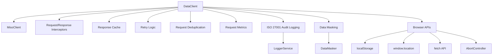

# DataClient Browser Wrapper Implementation Plan

## Overview

Create a browser-compatible `DataClient` wrapper around `MisoClient` that provides enhanced HTTP client capabilities for React/front-end applications. The client will handle authentication, error handling, request/response interceptors, cancellation, caching, retry logic, and **ISO 27001 compliance** with audit logging and data masking.

## Architecture



## File Structure

### New Files

- `src/utils/data-client.ts` - Main DataClient class
- `src/types/data-client.types.ts` - Type definitions for DataClient
- `tests/unit/data-client.test.ts` - Comprehensive unit tests

### Modified Files

- `src/index.ts` - Export DataClient and types
- `CHANGELOG.md` - Document new feature

## Implementation Details

### 1. Type Definitions (`src/types/data-client.types.ts`)

Create interfaces for:

- `DataClientConfig` - Configuration options (baseUrl, cache settings, retry settings, audit config)
- `ApiRequestOptions` - Extended RequestInit with skipAuth, retries, signal, timeout, cache options
- `InterceptorConfig` - Request/response/error interceptors
- `RequestMetrics` - Metrics tracking structure
- `CacheEntry` - Cache storage structure
- `AuditConfig` - ISO 27001 audit configuration (level, batchSize, skipEndpoints)
- Error classes: `NetworkError`, `TimeoutError`, `AuthenticationError` (extending base `ApiError`)

### 2. Core DataClient Class (`src/utils/data-client.ts`)

**Features to implement:**

#### Authentication Management

- Token retrieval from localStorage (multiple key support)
- Automatic token refresh on 401 errors
- Login redirect handling
- Token validation using MisoClient

#### ISO 27001 Compliance Features

**Audit Logging Integration:**

- Integrate with `MisoClient.log` (LoggerService) for audit trail
- Log all HTTP requests/responses with metadata:
  - Request method, URL, headers (masked)
  - Response status, duration, size
  - User context (extracted from JWT)
  - Error details (if applicable)
- Support audit levels: `minimal`, `standard`, `detailed`, `full`
- Batch audit logs to minimize network overhead
- Skip audit for specified endpoints (health checks, etc.)

**Data Masking:**

- Use `DataMasker` class to mask sensitive data before logging
- Mask sensitive fields in:
  - Request headers (Authorization, tokens, cookies)
  - Request bodies (passwords, secrets, PII, financial data)
  - Response bodies (especially error responses)
- Support custom sensitive fields configuration
- Recursive masking for nested objects and arrays
- Truncate large payloads before masking (performance optimization)

**Security Controls:**

- Never log client credentials (clientId, clientSecret)
- Mask all authentication tokens
- Protect PII (email, phone, SSN, etc.)
- Protect financial data (credit cards, bank accounts)
- Secure error handling (don't expose sensitive data in errors)

#### Request/Response Interceptors

- `onRequest` - Transform requests before sending (with masking support)
- `onResponse` - Transform responses after receiving (with masking support)
- `onError` - Handle errors globally (with audit logging)

#### Request Cancellation

- AbortController support via `signal` option
- Per-request timeout support
- Automatic cleanup on component unmount
- Audit log cancellation events

#### Response Caching

- In-memory cache for GET requests
- Configurable TTL per request
- Cache key generation from endpoint + options
- Cache invalidation methods
- Audit log cache hits/misses (optional, configurable)

#### Retry Logic

- Exponential backoff for retryable errors (5xx, network errors)
- Configurable retry count and base delay
- Skip retry for non-retryable errors (4xx except 401/403)
- Audit log retry attempts

#### Request Deduplication

- Track pending requests by cache key
- Return same promise for duplicate concurrent requests
- Cleanup on completion
- Audit log deduplication events (optional)

#### Request Metrics

- Track total requests, failures, average response time
- Response time distribution
- Error rate tracking
- Audit log metrics (anonymized, no PII)

#### Error Handling

- Custom error types (NetworkError, TimeoutError, AuthenticationError)
- Structured error responses (masked before logging)
- Automatic login redirect on auth errors
- Audit log all errors with masked sensitive data

#### Browser Compatibility

- Check for browser environment (window, localStorage, fetch)
- Handle SSR scenarios gracefully
- Use browser APIs (AbortController, navigator.onLine)
- Graceful degradation when browser APIs unavailable

### 3. HTTP Methods

Implement all standard HTTP methods with ISO 27001 audit logging:

- `get<T>(endpoint, options?)` - With caching support and audit logging
- `post<T>(endpoint, data?, options?)` - With request/response audit
- `put<T>(endpoint, data?, options?)` - With request/response audit
- `patch<T>(endpoint, data?, options?)` - Uses fallback fetch with audit
- `delete<T>(endpoint, options?)` - With audit logging

All methods automatically:

- Extract user context from JWT token
- Mask sensitive data before audit logging
- Log request metadata (method, URL, headers, body size)
- Log response metadata (status, duration, size)
- Handle errors with masked error details

### 4. Utility Methods

- `setInterceptors(config)` - Configure interceptors
- `setLogLevel(level)` - Configure logging
- `setAuditConfig(config)` - Configure ISO 27001 audit settings
- `clearCache()` - Clear all cached responses
- `getMetrics()` - Get request metrics (anonymized)
- `isAuthenticated()` - Check auth status
- `redirectToLogin()` - Trigger login redirect

### 5. Integration with MisoClient

- Singleton MisoClient instance management
- Use `MisoClient.requestWithAuthStrategy()` for authenticated requests
- Use `MisoClient.log` for ISO 27001 audit logging
- Fallback to standard fetch when MisoClient fails
- Handle PATCH requests (not supported by MisoClient) via fetch fallback
- Extract user context from JWT using MisoClient utilities

### 6. ISO 27001 Audit Logging Implementation

**Audit Log Structure:**

```typescript
{
  timestamp: string;
  method: string;
  url: string;
  statusCode: number;
  duration: number;
  requestSize: number;
  responseSize: number;
  userId?: string;
  error?: string; // Masked
  requestHeaders?: Record<string, string>; // Masked
  responseHeaders?: Record<string, string>; // Masked
  requestBody?: unknown; // Masked and truncated
  responseBody?: unknown; // Masked and truncated
}
```

**Audit Configuration:**

- `level`: 'minimal' | 'standard' | 'detailed' | 'full'
- `batchSize`: number (default: 10)
- `maxResponseSize`: number (default: 10000)
- `maxMaskingSize`: number (default: 50000)
- `skipEndpoints`: string[] (e.g., ['/health', '/metrics'])

**Data Masking Integration:**

- Use `DataMasker.maskSensitiveData()` before logging
- Support custom sensitive fields config via MisoClient config
- Mask recursively for nested objects/arrays
- Truncate large payloads before masking (performance)

## Testing Strategy (`tests/unit/data-client.test.ts`)

### Test Coverage Goals

- 80%+ branch coverage
- Test all error paths
- Test browser API interactions
- Test MisoClient integration
- Test caching, retry, deduplication logic
- **Test ISO 27001 audit logging and data masking**

### Test Categories

#### Unit Tests

1. **Constructor & Configuration**

   - Default configuration
   - Custom baseUrl
   - Browser environment detection
   - Audit configuration

2. **Authentication**

   - Token retrieval from localStorage
   - Multiple token key support
   - Token validation via MisoClient
   - Login redirect on missing token
   - Token refresh on 401

3. **Request Methods**

   - GET with caching
   - POST/PUT/PATCH/DELETE
   - Request options (headers, body, signal)
   - Skip auth option

4. **ISO 27001 Audit Logging**

   - Audit log creation for all requests
   - User context extraction from JWT
   - Audit level configuration (minimal/standard/detailed/full)
   - Batch logging
   - Skip endpoints configuration
   - Error audit logging

5. **Data Masking**

   - Sensitive field detection
   - Request header masking
   - Request body masking
   - Response body masking
   - Nested object masking
   - Array masking
   - Large payload truncation
   - Custom sensitive fields config

6. **Interceptors**

   - Request transformation
   - Response transformation
   - Error handling
   - Async interceptors
   - Masking in interceptors

7. **Caching**

   - Cache hit/miss scenarios
   - TTL expiration
   - Cache key generation
   - Cache invalidation
   - Audit log cache events (optional)

8. **Retry Logic**

   - Exponential backoff
   - Retryable vs non-retryable errors
   - Max retry limit
   - Retry delay calculation
   - Audit log retry attempts

9. **Request Deduplication**

   - Duplicate request detection
   - Promise sharing
   - Cleanup after completion
   - Audit log deduplication (optional)

10. **Error Handling**

    - Network errors
    - Timeout errors
    - Authentication errors
    - HTTP error responses
    - Error transformation
    - Masked error logging

11. **MisoClient Integration**

    - Successful MisoClient requests
    - MisoClient fallback to fetch
    - PATCH request fallback
    - Auth strategy creation
    - LoggerService integration
    - DataMasker integration

12. **Browser APIs**

    - AbortController cancellation
    - Timeout handling
    - localStorage operations
    - window.location redirect
    - Online/offline detection
    - SSR compatibility

### Mock Strategy

- Mock `MisoClient` instance (including `log` property)
- Mock `LoggerService` methods
- Mock `DataMasker` static methods
- Mock `localStorage`
- Mock `window.location`
- Mock `fetch` API
- Mock `AbortController`
- Mock `navigator.onLine`

## Code Style & Conventions

### Follow Repository Rules

- Use camelCase for all public API (methods, properties, return values)
- Use TypeScript strict mode
- Private methods for internal logic
- JSDoc comments for public methods
- Error handling: return empty arrays/objects on error, log with console.warn/error
- File size: Keep under 500 lines (split if needed)
- Method size: Keep under 20-30 lines

### Browser Compatibility

- Check for browser environment before using browser APIs
- Provide fallbacks for SSR scenarios
- Use feature detection (AbortController, localStorage)

### ISO 27001 Compliance

- Never log unmasked sensitive data
- Always use DataMasker before logging
- Support audit level configuration
- Batch audit logs for performance
- Truncate large payloads before masking
- Extract user context for audit trail

## Export Strategy

Export from `src/index.ts`:

```typescript
export { DataClient, dataClient } from './utils/data-client';
export type {
  DataClientConfig,
  ApiRequestOptions,
  InterceptorConfig,
  RequestMetrics,
  AuditConfig,
} from './types/data-client.types';
```

## Documentation

Update:

- `README.md` - Add DataClient usage examples with ISO 27001 features
- `docs/api-reference.md` - Document DataClient API and audit logging
- `CHANGELOG.md` - Add entry for new feature

## Security Considerations

### ⚠️ Browser Security Requirements

**CRITICAL:** Never expose `clientSecret` in browser/client-side code. Client secrets are sensitive credentials that should only be used in server-side environments.

### Client Token Pattern (Recommended)

For browser applications, use a server-provided client token pattern:

1. **Server-side**: Fetch client token using `clientSecret` (secure)
2. **Server provides token**: Send token to browser via API endpoint or initial page load
3. **Browser uses token**: DataClient uses token for audit logging (no `clientSecret` exposed)
4. **Token refresh**: Browser calls server endpoint to refresh expired tokens

### Implementation Requirements

#### Client Token Support

- Add `clientToken?: string` to `MisoClientConfig` (optional pre-obtained token)
- Add `clientTokenExpiresAt?: Date | string` to track expiration
- Add `onClientTokenRefresh?: () => Promise<{ token: string; expiresIn: number }>` callback for refresh
- Modify `InternalHttpClient.getClientToken()` to:
  - Use provided `clientToken` if available and not expired
  - Call `onClientTokenRefresh` callback when token expires
  - Fallback to `fetchClientToken()` with `clientSecret` only if no callback provided

#### Security Controls

- **Short expiration**: Browser tokens should expire in 15-30 minutes (vs 1 hour server-side)
- **User authentication**: Token refresh endpoint must require authenticated user
- **Rate limiting**: Implement rate limiting on token refresh endpoint
- **CORS validation**: Restrict token endpoint to authorized origins
- **Audit logging**: Log all token refresh requests
- **Memory-only storage**: Never store tokens in localStorage
- **HTTPS enforcement**: Require TLS 1.2+ for all communications

### ISO 27001 Compliance

The client token pattern is acceptable for ISO 27001 compliance when:

- ✅ Server-side token refresh with user authentication
- ✅ Short token expiration (15-30 minutes)
- ✅ Rate limiting implemented
- ✅ CORS validation
- ✅ Audit logging of token requests
- ✅ Memory-only token storage
- ✅ HTTPS enforcement
- ✅ Monitoring and alerting

## Implementation Order

1. Create type definitions (`data-client.types.ts`)
2. Implement core DataClient class with basic functionality
3. Add authentication and MisoClient integration
4. **Add client token support** (clientToken, clientTokenExpiresAt, onClientTokenRefresh)
5. **Add ISO 27001 audit logging integration**
6. **Add data masking integration**
7. Add interceptors support
8. Add caching functionality
9. Add retry logic
10. Add request deduplication
11. Add metrics tracking
12. Add error handling and custom error types
13. Write comprehensive unit tests (including ISO 27001 tests and security tests)
14. Export from index.ts
15. Update documentation with security warnings and client token pattern

## Success Criteria

- All features implemented and tested
- 80%+ test coverage
- Browser-compatible (works in React/Vue/etc.)
- Follows repository coding conventions
- Properly integrated with MisoClient
- **ISO 27001 compliant audit logging**
- **Sensitive data masking implemented**
- Comprehensive error handling
- Type-safe TypeScript implementation

## ISO 27001 Compliance Checklist

- ✅ Audit trail for all HTTP requests/responses
- ✅ Sensitive data masking before logging
- ✅ User context extraction and logging
- ✅ Configurable audit levels
- ✅ Batch logging for performance
- ✅ Large payload truncation
- ✅ Custom sensitive fields support
- ✅ Error audit logging with masking
- ✅ Security controls (no credential logging)
- ✅ Performance optimizations
- ✅ Client token refresh pattern (server-side token management)
- ✅ Memory-only token storage (no localStorage)
- ✅ HTTPS enforcement
- ✅ Rate limiting support
- ✅ CORS validation support

## Security Implementation Checklist

- ✅ Never expose `clientSecret` in browser code
- ✅ Support server-provided client tokens
- ✅ Implement token refresh callback pattern
- ✅ Short token expiration for browser tokens (15-30 min)
- ✅ User authentication required for token refresh
- ✅ Rate limiting on token refresh endpoint
- ✅ CORS validation
- ✅ Audit logging of token requests
- ✅ Memory-only token storage
- ✅ HTTPS enforcement
- ✅ Security documentation and warnings