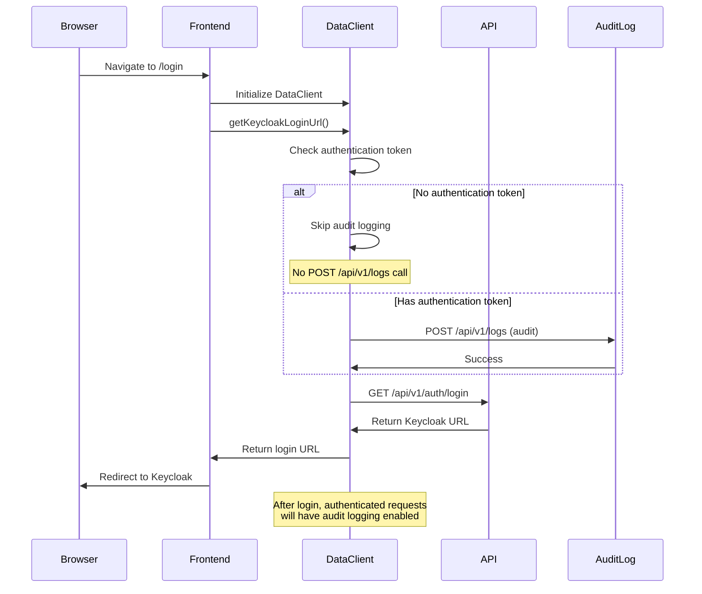

# Fix miso-client Audit Logging Bug for Unauthenticated Requests

## Overview

Fix the bug in `@aifabrix/miso-client` (v3.0.0) where audit logging attempts to authenticate unauthenticated requests (like `/api/v1/auth/login`), causing 401 Unauthorized errors. The SDK should skip audit logging for unauthenticated requests or handle audit failures gracefully.

## Problem Analysis

### Current Bug

**Issue**: `@aifabrix/miso-client` SDK automatically attempts to audit log ALL HTTP requests, including unauthenticated requests like `/api/v1/auth/login`. This creates a circular dependency:

1. User tries to log in → GET `/api/v1/auth/login` (unauthenticated)
2. SDK attempts to audit log → POST `/api/v1/logs` (requires authentication)
3. Audit logging fails → 401 Unauthorized (user not authenticated yet)
4. This creates noise in error logs and potential performance issues

### Evidence from Error Log

```
Line 11: GET /api/v1/auth/login → 400 (Bad Request) - Main request
Lines 32, 67: POST /api/v1/logs → 401 (Unauthorized) - Audit logging attempts
```

The audit logging calls occur in `executeRequest` (lines 36671, 36688 in SDK), triggered automatically for all requests.

### Root Cause

The SDK's `DataClient.executeRequest()` method unconditionally attempts audit logging for all requests, regardless of authentication status. Audit logging requires authentication (user token or client token), but login requests are by definition unauthenticated.

## Rules and Standards

This plan must comply with the following rules:

- **[Critical Policies](.cursor/rules/quality-rules/critical-policies.md)** - ⚠️ MANDATORY: Build validation, code quality, and validation order requirements
- **[Code Reuse Standards](.cursor/rules/dev-rules/code-reuse-standards.md)** - Code reuse patterns and anti-duplication rules
- **[Miso Client Integration](.cursor/rules/ui-rules/miso-client-integration.md)** - DataClient integration patterns for miso-ui
- **[Logging Standards](.cursor/rules/dev-rules/logging-standards.md)** - Structured logging with LoggerService
- **[Testing Standards](.cursor/rules/dev-rules/testing-standards.md)** - Test structure and patterns

**Key Requirements**:

- **Build Validation**: Run `cd packages/miso-controller && npm run build` FIRST (must succeed before any other checks)
- **Code Reuse**: Check for existing audit logging patterns before modifying
- **Testing**: Integration tests with mocked services, real HTTP calls using supertest
- **Logging**: Use LoggerService for all logging operations (no console.log)
- **Backward Compatibility**: Changes must not break existing functionality

## Before Development

- [ ] Understand current audit logging implementation in miso-client SDK
- [ ] Review how DataClient determines authentication status
- [ ] Check if SDK has configuration options to disable audit logging for specific endpoints
- [ ] Review error handling patterns in SDK for audit logging failures
- [ ] Understand the difference between user tokens and client tokens in audit context
- [ ] Review existing workarounds or patches in the codebase

## Solution Architecture

### Option 1: Skip Audit Logging for Unauthenticated Requests (Recommended)

**Approach**: Modify SDK to check authentication status before attempting audit logging.

**Implementation**:

- Check if user token or client token exists before audit logging
- Skip audit logging if no authentication token available
- Log warning (not error) if audit logging is skipped

**Pros**:

- Prevents unnecessary API calls
- Reduces error log noise
- Better performance
- Clear separation of concerns

**Cons**:

- Requires SDK modification (if SDK is external, may need workaround)

### Option 2: Graceful Audit Logging Failure Handling (Fallback)

**Approach**: Catch 401 errors from audit logging and handle gracefully.

**Implementation**:

- Wrap audit logging calls in try-catch
- If audit logging returns 401, log warning and continue (don't fail main request)
- Don't propagate audit logging errors to main request

**Pros**:

- Works even if SDK can't be modified
- Backward compatible
- Prevents audit logging failures from breaking main requests

**Cons**:

- Still makes unnecessary API calls
- May still create noise in logs

### Option 3: Configuration-Based Audit Logging (Best Long-term)

**Approach**: Add configuration option to disable audit logging for specific endpoints or patterns.

**Implementation**:

- Add `audit.skipPatterns` or `audit.skipEndpoints` configuration
- Skip audit logging for endpoints matching patterns (e.g., `/api/v1/auth/login`, `/api/v1/auth/callback`)
- Default behavior unchanged for backward compatibility

**Pros**:

- Most flexible solution
- Allows fine-grained control
- Backward compatible

**Cons**:

- Requires SDK modification
- More complex implementation

## Recommended Solution

**Primary**: Option 1 (Skip Audit Logging for Unauthenticated Requests)

**Fallback**: Option 2 (Graceful Failure Handling) if SDK cannot be modified

## Implementation

### Phase 1: Investigate SDK Source Code

**Task**: Determine if `@aifabrix/miso-client` is an external package or local package.

**Steps**:

1. Check if SDK source code exists in workspace
2. Search for `executeRequest` method implementation
3. Locate audit logging code (`logAuditEvent`, `audit` calls)
4. Understand how SDK determines authentication status

**Files to Check**:

- `node_modules/@aifabrix/miso-client/` (if external)
- `packages/miso-client/` (if local)
- Search for `executeRequest` in codebase

### Phase 2: Implement Fix

#### If SDK is Local (in workspace)

**File**: `packages/miso-client/src/client/data-client.ts` (or similar) - **MODIFY**

**Changes**:

1. Add authentication check before audit logging
2. Skip audit logging if no token available
3. Add warning log when audit logging is skipped

**Implementation Pattern**:

```typescript
// In executeRequest method, before audit logging:
async executeRequest(...) {
  // ... existing request logic ...
  
  // Check if authentication token exists before audit logging
  const hasAuthToken = this.hasUserToken() || this.hasClientToken();
  
  if (hasAuthToken && this.config.audit?.enabled) {
    try {
      await this.logAuditEvent(...);
    } catch (error) {
      // Don't fail main request if audit logging fails
      if (error.status === 401) {
        // User not authenticated - skip audit logging silently
        this.logger.warn('Audit logging skipped: user not authenticated');
      } else {
        // Other errors - log but don't fail request
        this.logger.warn('Audit logging failed:', error);
      }
    }
  } else if (this.config.audit?.enabled) {
    // No auth token - skip audit logging
    this.logger.debug('Audit logging skipped: no authentication token available');
  }
  
  // ... continue with response ...
}
```

#### If SDK is External (cannot modify)

**File**: `packages/miso-ui/src/auth/services/auth-client.service.ts` - **MODIFY**

**Workaround**: Configure DataClient to disable audit logging for login requests.

**Implementation**:

```typescript
// Option A: Disable audit logging entirely for login flow
const loginDataClient = new DataClient({
  baseUrl: appConfig.api.baseUrl,
  misoConfig: {
    controllerUrl,
    clientId: appConfig.auth.client.id,
    clientTokenUri: '/api/v1/auth/client-token'
  },
  loginUrl: '/login',
  logoutUrl: '/logout',
  timeout: 30000,
  // Disable audit logging for login requests
  audit: {
    enabled: false  // Disable for unauthenticated requests
  }
});

// Option B: Use separate DataClient instance for authenticated requests
// After login, create new DataClient with audit enabled
```

**Alternative Workaround**: Wrap DataClient calls in try-catch to handle audit logging errors gracefully.

### Phase 3: Add Configuration Option (Optional Enhancement)

**File**: `packages/miso-ui/src/config/app.config.ts` - **MODIFY**

**Add Configuration**:

```typescript
export const appConfig = {
  // ... existing config ...
  audit: {
    enabled: true,
    level: 'standard',
    // Skip audit logging for these endpoints (patterns)
    skipPatterns: [
      '/api/v1/auth/login',
      '/api/v1/auth/callback',
      '/api/v1/auth/client-token'
    ]
  }
};
```

### Phase 4: Update Error Handling

**File**: `packages/miso-ui/src/auth/services/auth-client.service.ts` - **MODIFY**

**Changes**:

- Handle audit logging errors gracefully
- Don't fail login flow if audit logging fails
- Log warnings instead of errors for audit logging failures

**Implementation**:

```typescript
async getKeycloakLoginUrl(redirect: string, state?: string): Promise<LoginResponse> {
  try {
    // ... existing code ...
    const response = await dataClient.get<{...}>(url);
    // ... handle response ...
  } catch (error) {
    // Check if error is from audit logging (401 on /api/v1/logs)
    if (error instanceof ApiError && 
        error.message.includes('401') && 
        error.config?.url?.includes('/api/v1/logs')) {
      // Audit logging failed - log warning but don't fail login
      console.warn('[AuthClientService] Audit logging failed for login request:', error);
      // Retry request without audit logging (if possible)
      // Or continue with login flow
    }
    // ... existing error handling ...
  }
}
```

## Testing Strategy

### Unit Tests

**File**: `packages/miso-controller/tests/unit/services/auth/client-auth.service.test.ts` (or create new test file)

**Test Cases**:

1. ✅ Audit logging skipped when no authentication token available
2. ✅ Audit logging succeeds when authentication token available
3. ✅ Main request succeeds even if audit logging fails with 401
4. ✅ Main request succeeds even if audit logging fails with other errors
5. ✅ Configuration option to disable audit logging works correctly

### Integration Tests

**File**: `packages/miso-controller/tests/integration/routes/auth-core.routes.test.ts` - **MODIFY**

**Test Cases**:

1. ✅ Login request succeeds without audit logging errors
2. ✅ No 401 errors in logs for `/api/v1/logs` during login
3. ✅ Authenticated requests still have audit logging
4. ✅ Error handling doesn't break login flow

### Manual Testing

**Test Scenarios**:

1. Open browser console
2. Navigate to login page
3. Verify no 401 errors for `/api/v1/logs` endpoint
4. Complete login flow successfully
5. Verify audit logging works for authenticated requests

## Files to Modify

### If SDK is Local

1. `packages/miso-client/src/client/data-client.ts` (or similar) - **MODIFY**

   - Add authentication check before audit logging
   - Skip audit logging for unauthenticated requests
   - Handle audit logging errors gracefully

### If SDK is External (Workaround)

1. `packages/miso-ui/src/auth/services/auth-client.service.ts` - **MODIFY**

   - Disable audit logging for login requests
   - Or handle audit logging errors gracefully
   - Add error handling for audit logging failures

2. `packages/miso-ui/src/config/app.config.ts` - **MODIFY** (Optional)

   - Add configuration for audit logging skip patterns

### Testing

1. `packages/miso-controller/tests/integration/routes/auth-core.routes.test.ts` - **MODIFY**

   - Add test cases for audit logging behavior during login

2. `packages/miso-ui/src/auth/services/auth-client.service.test.ts` - **CREATE** (if doesn't exist)

   - Add unit tests for audit logging error handling

## Migration Steps

### Step 1: Investigate SDK Source

1. Determine if SDK is local or external
2. Locate audit logging code
3. Understand authentication check mechanism

### Step 2: Implement Fix

1. **If SDK is local**: Modify SDK to skip audit logging for unauthenticated requests
2. **If SDK is external**: Implement workaround in auth-client.service.ts

### Step 3: Update Error Handling

1. Add graceful error handling for audit logging failures
2. Ensure login flow doesn't fail due to audit logging errors
3. Add appropriate logging (warnings, not errors)

### Step 4: Testing

1. Write unit tests for new behavior
2. Write integration tests for login flow
3. Manual testing in browser

### Step 5: Documentation

1. Document the fix/workaround
2. Update AUTHENTICATION.md if needed
3. Add comments explaining why audit logging is skipped

## Definition of Done

Before marking this plan as complete, ensure:

1. **Build**: Run `cd packages/miso-controller && npm run build` FIRST (must complete successfully)
2. **Format**: Run `pnpm run fmt` AFTER build (must complete successfully)
3. **Markdown Lint**: Run `pnpm run md:lint` and `pnpm run md:fix` if needed AFTER format
4. **Lint**: Run `cd packages/miso-controller && npm run lint` AFTER markdown lint (zero warnings/errors required)
5. **Frontend Lint**: Run `cd packages/miso-ui && npm run lint` AFTER markdown lint (zero warnings/errors required)
6. **Test**: Run `cd packages/miso-controller && npm test` AFTER lint (all tests must pass)
7. **Frontend Test**: Run `cd packages/miso-ui && npm test` AFTER lint (all tests must pass)
8. **Validation Order**: BUILD → FORMAT → MARKDOWN LINT → LINT → TEST (mandatory sequence)
9. No 401 errors in browser console for `/api/v1/logs` during login
10. Login flow works correctly
11. Audit logging still works for authenticated requests
12. All rule requirements met

## Testing Checklist

- [ ] No 401 errors in browser console for `/api/v1/logs` during login
- [ ] Login flow completes successfully
- [ ] Audit logging works for authenticated requests
- [ ] Error handling doesn't break login flow
- [ ] Configuration options work correctly (if implemented)
- [ ] Unit tests pass
- [ ] Integration tests pass
- [ ] Manual testing in browser confirms fix
- [ ] Build succeeds with zero errors
- [ ] Linting passes with zero warnings/errors

## Error Log Analysis

### Current Error Pattern

```
Line 11: GET /api/v1/auth/login → 400 (Bad Request) - Main request (separate issue)
Lines 32, 67: POST /api/v1/logs → 401 (Unauthorized) - Audit logging attempts (BUG)
```

### Expected Behavior After Fix

```
Line 11: GET /api/v1/auth/login → 400 (Bad Request) - Main request (separate issue)
No POST /api/v1/logs requests during login (audit logging skipped)
```

### Success Criteria

- ✅ No 401 errors for `/api/v1/logs` in browser console during login
- ✅ Login flow works correctly
- ✅ Audit logging still works for authenticated requests
- ✅ No performance degradation

## Security Considerations

### ISO 27001 Compliance

**A.12 Operations Security**:

- Audit logging failures should not break main functionality
- Error handling should not expose internal details
- Logging should be appropriate (warnings, not errors, for expected behavior)

**A.16 Incident Management**:

- Audit logging should be resilient to failures
- Main requests should succeed even if audit logging fails
- Appropriate logging for troubleshooting

### Security Best Practices

1. **Don't fail on audit logging errors**: Main request should succeed even if audit logging fails
2. **Appropriate logging**: Use warnings for expected behavior (skipping audit), errors for unexpected failures
3. **No information leakage**: Don't expose internal SDK details in error messages
4. **Backward compatibility**: Changes should not break existing functionality

## Architecture Diagram



## Key Points

1. **Root Cause**: SDK attempts audit logging for all requests, including unauthenticated ones
2. **Solution**: Skip audit logging when no authentication token available
3. **Fallback**: If SDK can't be modified, disable audit logging for login requests or handle errors gracefully
4. **Testing**: Verify no 401 errors during login, audit logging still works for authenticated requests
5. **Backward Compatibility**: Changes must not break existing functionality

## Next Steps

1. **Investigate**: Determine if SDK is local or external
2. **Implement**: Apply appropriate fix based on investigation
3. **Test**: Verify fix works correctly
4. **Document**: Update documentation if needed

## References

- Error log: `/workspace/aifabrix-miso/error.txt`
- Auth client service: `packages/miso-ui/src/auth/services/auth-client.service.ts`
- Miso client integration rules: `.cursor/rules/ui-rules/miso-client-integration.md`