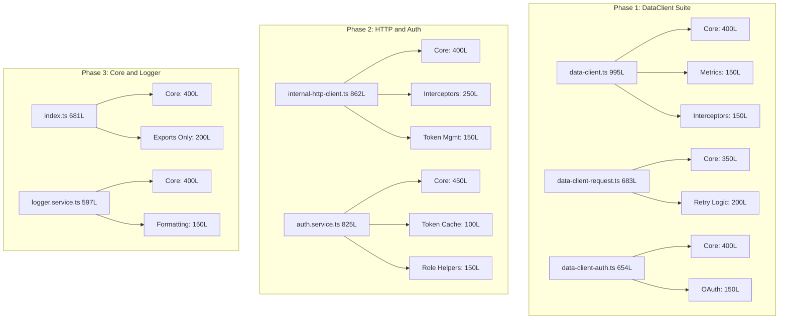

# Code Size Compliance Refactoring

## Problem Statement

7 source files exceed the 500-line limit defined in project rules:

| File | Lines | Over by | Priority |

|------|-------|---------|----------|

| `src/utils/data-client.ts` | 995 | +495 | High |

| `src/utils/internal-http-client.ts` | 862 | +362 | High |

| `src/services/auth.service.ts` | 825 | +325 | Medium |

| `src/utils/data-client-request.ts` | 683 | +183 | Medium |

| `src/index.ts` | 681 | +181 | Low |

| `src/utils/data-client-auth.ts` | 654 | +154 | Medium |

| `src/services/logger/logger.service.ts` | 597 | +97 | Low |

## Refactoring Strategy



## Phase 1: DataClient Suite (3 files, ~2330 lines total)

### 1.1 Refactor [data-client.ts](src/utils/data-client.ts) (995 lines)

**Extract to new files:**

- `src/utils/data-client-metrics.ts` (~150 lines)
  - `getMetrics()`, `resetMetrics()`
  - Metrics tracking logic
  - Response time calculations

- `src/utils/data-client-interceptors.ts` (~150 lines)
  - `setRequestInterceptor()`, `setResponseInterceptor()`
  - `setErrorInterceptor()`
  - Interceptor management

**Remaining in data-client.ts:** ~500 lines (core DataClient class)

### 1.2 Refactor [data-client-request.ts](src/utils/data-client-request.ts) (683 lines)

**Extract to new file:**

- `src/utils/data-client-retry.ts` (~200 lines)
  - `shouldRetry()`, `calculateBackoff()`
  - Retry logic with exponential backoff
  - Circuit breaker pattern

**Remaining in data-client-request.ts:** ~480 lines

### 1.3 Refactor [data-client-auth.ts](src/utils/data-client-auth.ts) (654 lines)

**Extract to new file:**

- `src/utils/data-client-oauth.ts` (~150 lines)
  - `handleOAuthCallback()`
  - OAuth state management
  - Token exchange logic

**Remaining in data-client-auth.ts:** ~500 lines

## Phase 2: HTTP Client and Auth Service (2 files, ~1687 lines total)

### 2.1 Refactor [internal-http-client.ts](src/utils/internal-http-client.ts) (862 lines)

**Extract to new files:**

- `src/utils/http-client-interceptors.ts` (~250 lines)
  - Request/response interceptor setup
  - Error interceptor handling
  - Retry interceptor logic

- `src/utils/http-client-token.ts` (~150 lines)
  - `fetchClientToken()`, `refreshClientToken()`
  - Token storage and expiration tracking
  - Token header management

**Remaining in internal-http-client.ts:** ~460 lines

### 2.2 Refactor [auth.service.ts](src/services/auth.service.ts) (825 lines)

**Extract to new files:**

- `src/utils/auth-token-cache.ts` (~100 lines)
  - `getTokenCacheKey()` - SHA-256 hash
  - `getCacheTtlFromToken()` - Smart TTL
  - `extractUserIdFromToken()` - JWT parsing

- `src/utils/auth-role-helpers.ts` (~150 lines)
  - `hasRole()`, `hasAnyRole()`, `hasAllRoles()`
  - `hasPermission()`, `hasAnyPermission()`, `hasAllPermissions()`

**Remaining in auth.service.ts:** ~500 lines

## Phase 3: Core Index and Logger (2 files, ~1278 lines total)

### 3.1 Refactor [index.ts](src/index.ts) (681 lines)

**Strategy:** Split into core class and re-exports

- Keep `MisoClient` class in `src/index.ts` (~400 lines)
- Move all `export * from` statements to end of file
- Consider extracting initialization logic to `src/miso-client-init.ts` if needed

**Target:** ~500 lines (mostly re-exports which don't count towards complexity)

### 3.2 Refactor [logger.service.ts](src/services/logger/logger.service.ts) (597 lines)

**Extract to new file:**

- `src/services/logger/logger-formatting.ts` (~150 lines)
  - Log message formatting
  - Context serialization
  - Timestamp formatting

**Remaining in logger.service.ts:** ~450 lines

## New Files Summary

| New File | Estimated Lines | Extracted From |

|----------|-----------------|----------------|

| `data-client-metrics.ts` | 150 | data-client.ts |

| `data-client-interceptors.ts` | 150 | data-client.ts |

| `data-client-retry.ts` | 200 | data-client-request.ts |

| `data-client-oauth.ts` | 150 | data-client-auth.ts |

| `http-client-interceptors.ts` | 250 | internal-http-client.ts |

| `http-client-token.ts` | 150 | internal-http-client.ts |

| `auth-token-cache.ts` | 100 | auth.service.ts |

| `auth-role-helpers.ts` | 150 | auth.service.ts |

| `logger-formatting.ts` | 150 | logger.service.ts |

## Implementation Order

1. **Phase 1** - DataClient suite (most critical, largest files)
2. **Phase 2** - HTTP Client and Auth (core infrastructure)
3. **Phase 3** - Index and Logger (lower priority)

## Definition of Done

For each refactored file:

1. **Build**: `npm run build` passes
2. **Lint**: `npm run lint` passes (0 errors/warnings)
3. **Test**: All existing tests pass
4. **Size**: File ≤ 500 lines
5. **Exports**: New utilities exported from `src/index.ts` if public API

## Validation Command

After each phase:

```bash
npm run build && npm run lint && npm test
```

## Risk Mitigation

- Refactor one file at a time
- Run full test suite after each extraction
- Keep extracted functions as internal (not exported) unless needed
- Maintain backward compatibility for all public APIs