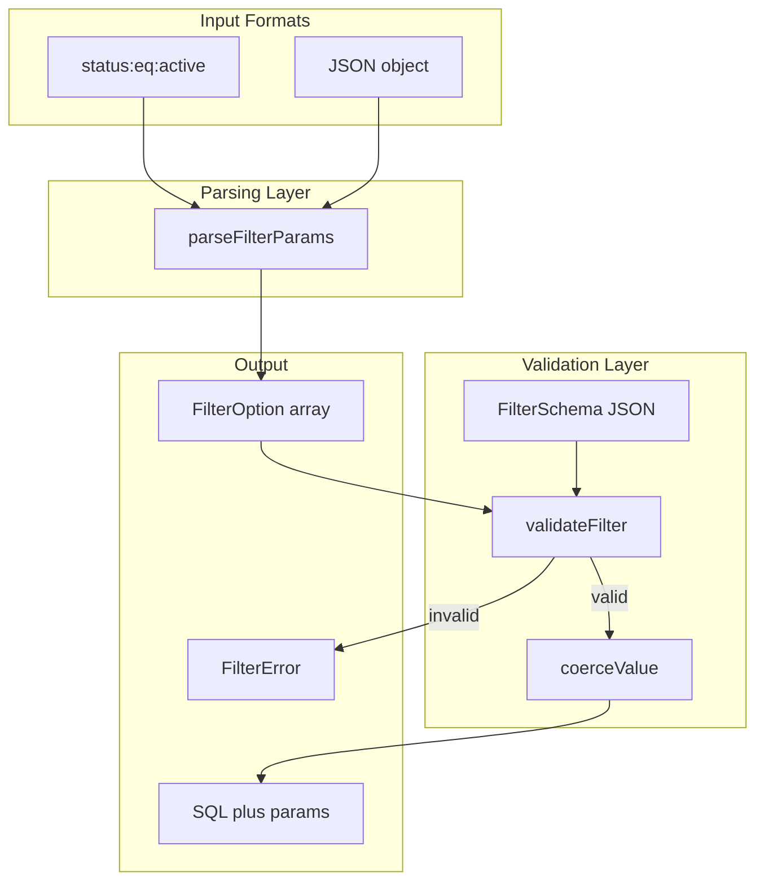

# Enhanced Filter System with Schema Validation

## Overview

Enhance the existing filter utilities to support:

- **Dual format parsing**: Colon format (`status:eq:active`) AND JSON format (`{"status":{"eq":"active"}}`)
- **Schema-based validation**: Define filterable fields, allowed operators, and value types per resource
- **Type coercion**: Validate and coerce values (string, number, boolean, uuid, timestamp, enum)
- **SQL compilation**: Generate PostgreSQL-safe parameterized queries
- **Human-readable errors**: RFC 7807 compliant structured error responses

## Rules and Standards

This plan must comply with the following rules from [Project Rules](.cursor/rules/project-rules.mdc):

- **[Code Style - TypeScript Conventions](.cursor/rules/project-rules.mdc#typescript-conventions)** - Prefer interfaces over types for public APIs, use strict TypeScript
- **[Code Style - Naming Conventions](.cursor/rules/project-rules.mdc#naming-conventions)** - camelCase for public API outputs, PascalCase for classes
- **[Error Handling - RFC 7807](.cursor/rules/project-rules.mdc#error-handling)** - All error responses must follow RFC 7807 Problem Details format
- **[Testing Conventions](.cursor/rules/project-rules.mdc#testing-conventions)** - Jest patterns, 80%+ branch coverage, mock all dependencies
- **[File Organization](.cursor/rules/project-rules.mdc#file-organization)** - src/types for types, src/utils for utilities, proper export strategy
- **[Code Size Guidelines](.cursor/rules/project-rules.mdc#code-size-guidelines)** - Files ≤500 lines, methods ≤20-30 lines
- **[Documentation](.cursor/rules/project-rules.mdc#documentation)** - JSDoc comments for public methods with param types and return types
- **[When Adding New Features](.cursor/rules/project-rules.mdc#when-adding-new-features)** - Update types first, then exports, tests, and documentation

**Key Requirements**:

- Use interfaces (not types) for FilterFieldDefinition, FilterSchema, FilterError, CompiledFilter
- All public API outputs use camelCase (no snake_case)
- Add JSDoc comments for all public functions with @param and @returns tags
- Use try-catch for all parsing operations, return meaningful error messages
- Test both success and error paths, including edge cases
- Keep files under 500 lines and methods under 20-30 lines
- Export new types and utilities from src/index.ts

## Before Development

- [ ] Read Code Style - TypeScript Conventions section from project-rules.mdc
- [ ] Review existing filter.utils.ts and filter.types.ts for patterns
- [ ] Review error handling patterns (RFC 7807 compliance)
- [ ] Understand testing requirements and mock patterns
- [ ] Review JSDoc documentation patterns in existing code
- [ ] Review export patterns in src/index.ts

## Current State

Existing filter utilities in [`src/utils/filter.utils.ts`](src/utils/filter.utils.ts) and [`src/types/filter.types.ts`](src/types/filter.types.ts) support:

- JSON format parsing only
- Basic operator validation
- In-memory filtering for mocks/tests
- FilterBuilder class for programmatic construction

**Current FilterOperator type is missing `ilike`** (PostgreSQL case-insensitive LIKE).

## Architecture



## Design

### 1. Colon Format Specification

```
field:operator:value
field:operator:value1,value2  (for in/nin operators)
field:operator:               (empty value for isNull/isNotNull)
```

**Examples:**

- `status:eq:active`
- `region:in:eu,us`
- `createdAt:gte:2024-01-01T12:00:00` (colons in value preserved)
- `deletedAt:isNull:` (empty value becomes null)

**Edge cases:**

- Timestamps with colons: `field:op:2024-01-01T12:00:00` preserves value
- Empty values for isNull: `field:isNull:` converts to null
- Commas only split for `in`/`nin` operators

### 2. Filter Schema Definition

```json
{
  "resource": "applications",
  "fields": {
    "name": { "column": "name", "type": "string", "operators": ["eq", "ilike", "in"] },
    "status": { "column": "status", "type": "enum", "enum": ["active", "disabled"], "operators": ["eq", "in"] }
  }
}
```

### 3. Operator Matrix

- **string**: eq, neq, in, nin, contains, like, ilike
- **number**: eq, neq, gt, gte, lt, lte, in, nin
- **boolean**: eq
- **uuid**: eq, in
- **timestamp**: eq, gt, gte, lt, lte
- **enum**: eq, in

### 4. SQL Compilation

- eq: `column = $n`
- neq: `column != $n`
- gt/gte/lt/lte: `column > $n` etc.
- in: `column = ANY($n)`
- nin: `column != ALL($n)`
- like: `column LIKE $n`
- ilike: `column ILIKE $n`
- contains: `column ILIKE $n` (with %%)
- isNull: `column IS NULL`
- isNotNull: `column IS NOT NULL`

### 5. Error Codes

- UNKNOWN_FIELD, INVALID_OPERATOR, INVALID_TYPE, INVALID_UUID, INVALID_DATE, INVALID_ENUM, INVALID_IN, INVALID_FORMAT

## Files to Create

- `src/types/filter-schema.types.ts` - Schema type definitions (interfaces)
- `src/utils/filter-schema.utils.ts` - Schema validation and SQL compilation
- `src/schemas/filter.schema.json` - Meta-schema (create directory)
- `tests/unit/filter-schema.utils.test.ts` - Schema validation tests
- `tests/unit/filter-colon-format.test.ts` - Colon format tests

## Files to Modify

- [`src/types/filter.types.ts`](src/types/filter.types.ts) - Add `ilike` operator
- [`src/utils/filter.utils.ts`](src/utils/filter.utils.ts) - Add colon format parsing
- [`src/index.ts`](src/index.ts) - Export new types and utilities
- [`docs/reference-utilities.md`](docs/reference-utilities.md) - Update documentation

## Definition of Done

Before marking this plan as complete, ensure:

1. **Build**: Run `npm run build` FIRST (must complete successfully)
2. **Lint**: Run `npm run lint` (must pass with zero errors/warnings)
3. **Test**: Run `npm test` AFTER lint (all tests must pass, 80%+ coverage for new code)
4. **Validation Order**: BUILD, then LINT, then TEST (mandatory sequence, never skip)
5. **File Size Limits**: Files under 500 lines, methods under 20-30 lines
6. **JSDoc Documentation**: All public functions have JSDoc with @param and @returns
7. **TypeScript**: Use interfaces (not types) for public API definitions
8. **Naming**: All public API outputs use camelCase (no snake_case)
9. **Error Handling**: Use try-catch for parsing operations, return meaningful errors
10. **RFC 7807**: FilterError follows Problem Details structure
11. **Documentation**: Update docs/reference-utilities.md with examples
12. All tasks completed
13. `ilike` operator added to FilterOperator type
14. Both colon and JSON formats work in parseFilterParams()
15. validateFilter() checks field, operator, and value against schema
16. coerceValue() handles type conversion per field type
17. compileFilter() produces parameterized PostgreSQL SQL
18. New types/utilities exported from src/index.ts
19. Tests cover success paths, error paths, and edge cases

---

## Plan Validation Report

**Date**: 2026-01-13

**Plan**: `.cursor/plans/45_enhanced_filter_system.plan.md`

**Status**: VALIDATED

### Applicable Rules

- Code Style - TypeScript Conventions - New interfaces and type definitions
- Code Style - Naming Conventions - Public API outputs
- Error Handling - RFC 7807 - FilterError structure
- Testing Conventions - New test files required
- File Organization - Proper src structure
- Code Size Guidelines - File/method limits
- Documentation - JSDoc requirements
- When Adding New Features - Types, exports, tests, docs

### Rule Compliance

- DoD Requirements: Documented with BUILD, LINT, TEST sequence
- TypeScript Conventions: Plan specifies interfaces over types
- Naming Conventions: Plan specifies camelCase for public APIs
- Error Handling: Plan includes RFC 7807 compliant error codes
- Testing: Plan includes test file creation
- Code Size: Plan references file/method limits
- Documentation: Plan includes JSDoc and docs update

### Plan Updates Made

- Added Rules and Standards section with applicable rule references
- Added Before Development checklist
- Updated Definition of Done with complete requirements
- Added validation order: BUILD, LINT, TEST
- Added file size limits and JSDoc requirements