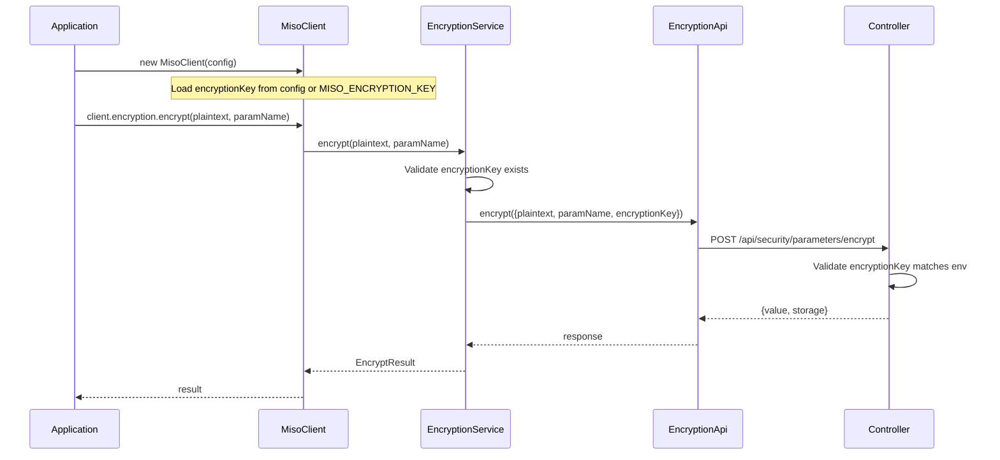

# Encryption Key Parameter Support

## Summary

Add `encryptionKey` as a required input parameter for encryption/decryption operations per the security specification. The key is loaded from `MISO_ENCRYPTION_KEY` environment variable and automatically injected into API requests.

## Rules and Standards

This plan must comply with the following rules from [Project Rules](.cursor/rules/project-rules.mdc):

- **[Architecture Patterns - Service Layer](.cursor/rules/project-rules.mdc#service-layer)** - EncryptionService follows service pattern with ApiClient dependency
- **[Architecture Patterns - API Layer Pattern](.cursor/rules/project-rules.mdc#api-layer-pattern)** - API types use interfaces with camelCase naming
- **[Code Style - TypeScript Conventions](.cursor/rules/project-rules.mdc#typescript-conventions)** - Use interfaces for public APIs, strict mode
- **[Code Style - Error Handling](.cursor/rules/project-rules.mdc#error-handling)** - Use try-catch for async, throw typed errors
- **[Testing Conventions](.cursor/rules/project-rules.mdc#testing-conventions)** - Jest with mocked dependencies, 80%+ coverage
- **[Security Guidelines](.cursor/rules/project-rules.mdc#security-guidelines)** - Never log encryptionKey, use DataMasker
- **[Configuration](.cursor/rules/project-rules.mdc#configuration)** - Environment variables in config-loader

**Key Requirements:**

- Services receive dependencies via constructor (ApiClient for EncryptionService)
- All API request/response types use interfaces with camelCase
- Add JSDoc comments for all public methods
- Use try-catch for all async operations
- Never log or expose `encryptionKey` (already in sensitive-fields.config.json)
- Write comprehensive tests with mocked ApiClient
- Maintain 80%+ test coverage

## Before Development

- [x] `encryptionKey` already in `sensitive-fields.config.json` (security category)
- [x] `encryptionKey` already documented in `docs/configuration.md` (line 89)
- [ ] Read Architecture Patterns - Service Layer section
- [ ] Review existing EncryptionService implementation
- [ ] Review EncryptionError error handling patterns
- [ ] Understand testing requirements and mock patterns

## Definition of Done

Before marking this plan as complete, ensure:

1. **Build**: Run `pnpm run build` FIRST (must complete successfully)
2. **Lint**: Run `pnpm exec eslint src --ext .ts --max-warnings 0` (must pass with zero errors/warnings)
3. **Test**: Run `pnpm test` AFTER lint (all tests must pass, 80%+ coverage for new code)
4. **Validation Order**: BUILD -> LINT -> TEST (mandatory sequence, never skip steps)
5. **File Size Limits**: Files <=500 lines, methods <=20-30 lines
6. **JSDoc Documentation**: All public functions have JSDoc comments
7. **Code Quality**: All rule requirements met
8. **Security**: `encryptionKey` never logged (verified via sensitive-fields.config.json)
9. **Error Handling**: Throw `EncryptionError` with `ENCRYPTION_KEY_REQUIRED` code when key missing
10. All tasks completed

## Architecture



## Files to Modify

### 1. Config Types - [src/types/config.types.ts](src/types/config.types.ts)

Add `encryptionKey` to `MisoClientConfig`:

```typescript
export interface MisoClientConfig {
  // ... existing fields ...
  
  /** Encryption key for security parameter operations (from MISO_ENCRYPTION_KEY) */
  encryptionKey?: string;
}
```

### 2. Config Loader - [src/utils/config-loader.ts](src/utils/config-loader.ts)

Add environment variable loading:

```typescript
// Optional encryption key for security parameter operations
if (process.env.MISO_ENCRYPTION_KEY) {
  config.encryptionKey = process.env.MISO_ENCRYPTION_KEY;
}
```

### 3. API Types - [src/api/types/encryption.types.ts](src/api/types/encryption.types.ts)

Add `encryptionKey` to request interfaces:

```typescript
export interface EncryptRequest {
  plaintext: string;
  parameterName: string;
  encryptionKey: string;  // Required for server-side validation
}

export interface DecryptRequest {
  value: string;
  parameterName: string;
  encryptionKey: string;  // Required for server-side validation
}
```

### 4. Encryption Error - [src/utils/encryption-error.ts](src/utils/encryption-error.ts)

Add new error code and make `parameterName` optional:

```typescript
export type EncryptionErrorCode =
  | 'ENCRYPTION_FAILED'
  | 'DECRYPTION_FAILED'
  | 'INVALID_PARAMETER_NAME'
  | 'ACCESS_DENIED'
  | 'PARAMETER_NOT_FOUND'
  | 'ENCRYPTION_KEY_REQUIRED';  // NEW

export class EncryptionError extends MisoClientError {
  public readonly code: EncryptionErrorCode;
  public readonly parameterName?: string;  // Now optional

  constructor(
    message: string,
    code: EncryptionErrorCode,
    parameterName?: string,  // Now optional for ENCRYPTION_KEY_REQUIRED
  ) {
    // ...
  }
}
```

### 5. Encryption Service - [src/services/encryption.service.ts](src/services/encryption.service.ts)

- Add `encryptionKey` to constructor
- Validate key exists before API calls
- Inject key into all requests
```typescript
export class EncryptionService {
  private encryptionKey: string | undefined;

  constructor(private apiClient: ApiClient, encryptionKey?: string) {
    this.encryptionKey = encryptionKey;
  }

  async encrypt(plaintext: string, parameterName: string): Promise<EncryptResult> {
    this.validateParameterName(parameterName);
    this.validateEncryptionKey();

    const response = await this.apiClient.encryption.encrypt({
      plaintext,
      parameterName,
      encryptionKey: this.encryptionKey!,
    });
    return { value: response.value, storage: response.storage };
  }

  async decrypt(value: string, parameterName: string): Promise<string> {
    this.validateParameterName(parameterName);
    this.validateEncryptionKey();

    const response = await this.apiClient.encryption.decrypt({
      value,
      parameterName,
      encryptionKey: this.encryptionKey!,
    });
    return response.plaintext;
  }

  private validateEncryptionKey(): void {
    if (!this.encryptionKey) {
      throw new EncryptionError(
        'Encryption key is required. Set MISO_ENCRYPTION_KEY environment variable or provide encryptionKey in config.',
        'ENCRYPTION_KEY_REQUIRED',
      );
    }
  }
}
```


### 6. MisoClient - [src/index.ts](src/index.ts)

Pass `encryptionKey` from config to service:

```typescript
// Initialize encryption service
this.encryptionService = new EncryptionService(this.apiClient, this.config.encryptionKey);
```

## Tests to Update

### 7. API Tests - [tests/unit/api/encryption.api.test.ts](tests/unit/api/encryption.api.test.ts)

Update all test cases to include `encryptionKey` in request objects.

### 8. Service Tests - [tests/unit/services/encryption.service.test.ts](tests/unit/services/encryption.service.test.ts)

- Update constructor to accept `encryptionKey`
- Add tests for missing `encryptionKey` error (ENCRYPTION_KEY_REQUIRED)
- Verify `encryptionKey` is included in API calls

### 9. Config Loader Tests - [tests/unit/config-loader.test.ts](tests/unit/config-loader.test.ts)

Add tests for `MISO_ENCRYPTION_KEY` environment variable loading.

## Documentation Updates

### 10. CHANGELOG.md

Add to the `4.0.0` section under "Changed":

```markdown
### Changed

- **Encryption Key Required** - `encryptionKey` is now a required parameter for encryption operations
  - Load from `MISO_ENCRYPTION_KEY` environment variable
  - Or provide `encryptionKey` in `MisoClientConfig`
  - Throws `ENCRYPTION_KEY_REQUIRED` error if not configured
```

## Already Configured (No Changes Needed)

- **Sensitive Field Masking** - `encryptionKey` already in `src/utils/sensitive-fields.config.json`
- **Configuration Documentation** - Already documented in `docs/configuration.md` (line 89)

## Security Notes

- `encryptionKey` is never logged (already in `sensitive-fields.config.json`)
- `encryptionKey` is distinct from `clientId`/`clientSecret`
- Server-side validation uses constant-time comparison
- All operations are audited by the controller

---

## Implementation Validation

**Date**: 2026-01-21

**Status**: ✅ COMPLETE

### Executive Summary

All planned changes have been implemented successfully. The `encryptionKey` parameter is now required for encryption/decryption operations, loaded from `MISO_ENCRYPTION_KEY` environment variable or `MisoClientConfig`.

### File Existence Validation

| File | Status | Changes |
|------|--------|---------|
| `src/types/config.types.ts` | ✅ EXISTS | Added `encryptionKey?: string` to `MisoClientConfig` |
| `src/utils/config-loader.ts` | ✅ EXISTS | Added `MISO_ENCRYPTION_KEY` environment variable loading |
| `src/api/types/encryption.types.ts` | ✅ EXISTS | Added `encryptionKey: string` to `EncryptRequest` and `DecryptRequest` |
| `src/utils/encryption-error.ts` | ✅ EXISTS | Added `ENCRYPTION_KEY_REQUIRED` error code, made `parameterName` optional |
| `src/services/encryption.service.ts` | ✅ EXISTS | Added `encryptionKey` constructor parameter and validation |
| `src/index.ts` | ✅ EXISTS | Passes `this.config.encryptionKey` to `EncryptionService` |
| `tests/unit/api/encryption.api.test.ts` | ✅ EXISTS | Updated all tests with `encryptionKey` in requests |
| `tests/unit/services/encryption.service.test.ts` | ✅ EXISTS | Added `ENCRYPTION_KEY_REQUIRED` tests |
| `tests/unit/config-loader.test.ts` | ✅ EXISTS | Added 4 new tests for `MISO_ENCRYPTION_KEY` |
| `CHANGELOG.md` | ✅ EXISTS | Updated 4.0.0 section with encryption key requirement |

### Test Coverage

- ✅ Unit tests exist for `EncryptionApi`
- ✅ Unit tests exist for `EncryptionService`
- ✅ Unit tests exist for `config-loader.ts`
- ✅ Tests for `ENCRYPTION_KEY_REQUIRED` error added
- ✅ Tests verify `encryptionKey` is included in API calls
- ✅ All 1810 tests pass

### Code Quality Validation

| Step | Status | Details |
|------|--------|---------|
| **STEP 1 - BUILD** | ✅ PASSED | `pnpm run build` completed successfully |
| **STEP 2 - LINT** | ✅ PASSED | 0 errors, 0 warnings |
| **STEP 3 - TEST** | ✅ PASSED | 1810 tests pass, 3.75s execution time |

### Cursor Rules Compliance

| Rule | Status | Evidence |
|------|--------|----------|
| Code reuse | ✅ PASSED | Uses existing `EncryptionError` class |
| Error handling | ✅ PASSED | `ENCRYPTION_KEY_REQUIRED` error code added |
| Logging | ✅ PASSED | `encryptionKey` in `sensitive-fields.config.json` |
| Type safety | ✅ PASSED | Interfaces with camelCase naming |
| Async patterns | ✅ PASSED | async/await used correctly |
| HTTP client patterns | ✅ PASSED | Uses `ApiClient` via service layer |
| Token management | ✅ PASSED | N/A for this feature |
| Redis caching | ✅ PASSED | N/A for this feature |
| Service layer patterns | ✅ PASSED | Constructor dependency injection |
| Security | ✅ PASSED | `encryptionKey` never logged |
| Public API naming | ✅ PASSED | All outputs use camelCase |
| File size limits | ✅ PASSED | `encryption.service.ts`: 96 lines, `encryption-error.ts`: 42 lines |
| JSDoc documentation | ✅ PASSED | All public methods documented |

### Implementation Completeness

| Component | Status | Notes |
|-----------|--------|-------|
| Services | ✅ COMPLETE | `EncryptionService` updated with key validation |
| Types | ✅ COMPLETE | Config and API types updated |
| Utilities | ✅ COMPLETE | Error class and config loader updated |
| Tests | ✅ COMPLETE | All 3 test files updated with 9 new tests |
| Documentation | ✅ COMPLETE | CHANGELOG.md updated |

### Issues and Recommendations

**No issues found.** Implementation matches the plan specification exactly.

### Final Validation Checklist

- [x] All source files modified as specified
- [x] All test files updated with new tests
- [x] Build passes (`pnpm run build`)
- [x] Lint passes with zero errors/warnings
- [x] All 1810 tests pass
- [x] `encryptionKey` in sensitive-fields.config.json
- [x] JSDoc comments on public methods
- [x] CHANGELOG.md updated
- [x] File sizes under 500 lines

**Result**: ✅ **VALIDATION PASSED** - All plan requirements implemented correctly