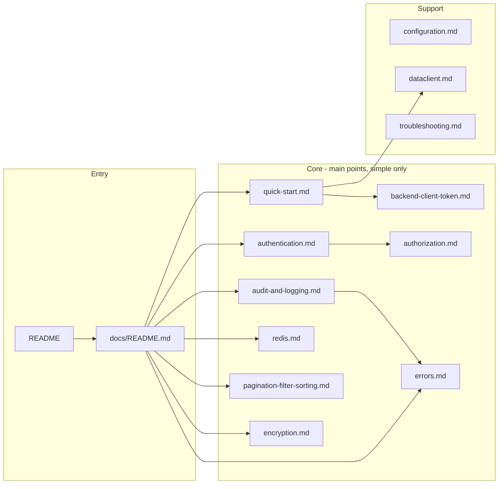

# Documentation Simplification Plan

## Current state

- **20 doc files** under `docs/` and `docs/examples/`, **~11.4k lines** total.
- **Largest:** [configuration.md](docs/configuration.md) (1074 lines), [reference-utilities.md](docs/reference-utilities.md) (1372), [reference-services.md](docs/reference-services.md) (1074), [reference-errors.md](docs/reference-errors.md) (1139), [reference-dataclient.md](docs/reference-dataclient.md) (1143).
- **Main value** (auth, audit, errors, Redis) is spread across many references; pagination/filter/sort and advanced config dominate the surface area.
- No single “backend client token” doc (unlike the Python SDK’s [backend-client-token.md](docs/backend-client-token.md) equivalent).

## Target structure (main points only)

Docs should center on **simple "how to use" only—no extra, no complexity**:

1. **Authentication** – token, validate, user, login/logout, client token for frontend.
2. **Audit and logging** – audit events, error logs, request context.
3. **Errors** – Express pattern (asyncHandler, handleRouteError, AppError), MisoClientError.
4. **Redis** – optional; cache for roles/permissions; fallback to controller.
5. **Pagination, filter, sorting** – one main topic; simple doc on how to use them.
6. **Encryption** – one main topic; simple doc on how to use (encrypt/decrypt).

No extra docs; no complexity.

---

## New documentation layout

| Doc                                   | Purpose                                                                                                          | Target size | Source / action                                                                                                                             |
| ------------------------------------- | ---------------------------------------------------------------------------------------------------------------- | ----------- | ------------------------------------------------------------------------------------------------------------------------------------------- |
| **README.md**                         | Benefits (short), quick start (backend 3 lines + frontend 1 line), links to main docs only                       | Shorten     | Current README; remove long blocks; point to quick-start and backend-client-token                                                           |
| **docs/README.md**                    | Index: what to read when (replaces api-reference.md)                                                             | ~60 lines   | New; replace [api-reference.md](docs/api-reference.md)                                                                                      |
| **docs/quick-start.md**               | Install, .env (required only), init, client-token route, frontend `autoInitializeDataClient`, validate + getUser | ~180 lines  | Rewrite [getting-started.md](docs/getting-started.md); cut 666→180                                                                          |
| **docs/backend-client-token.md**      | Env vars, Express one route, response shape, frontend one-liner (match Python style)                             | ~90 lines   | New                                                                                                                                         |
| **docs/authentication.md**            | getToken, validateToken, getUser, login, logout; minimal examples                                                | ~180 lines  | Merge and trim [reference-authentication.md](docs/reference-authentication.md) (713 lines)                                                  |
| **docs/authorization.md**             | getRoles, hasRole, hasPermission; minimal examples                                                               | ~100 lines  | Merge and trim [reference-authorization.md](docs/reference-authorization.md) (435 lines)                                                    |
| **docs/audit-and-logging.md**         | log.audit, log.error, withRequest, RFC 7807; when to use                                                         | ~150 lines  | New; from [reference-services.md](docs/reference-services.md) (logging) + [reference-errors.md](docs/reference-errors.md) (logging context) |
| **docs/errors.md**                    | asyncHandler, handleRouteError, AppError, MisoClientError; “must do” only                                        | ~120 lines  | Trim [reference-errors.md](docs/reference-errors.md) (1139→120)                                                                             |
| **docs/redis.md**                     | Redis optional; what is cached (roles/permissions); fallback behavior. Simple only.                              | ~80 lines   | New; from [configuration.md](docs/configuration.md) Redis + [reference-services.md](docs/reference-services.md) cache                       |
| **docs/pagination-filter-sorting.md** | How to use pagination, filter, sorting—simple way only. Minimal code.                                            | ~100 lines  | New; from [reference-utilities.md](docs/reference-utilities.md) + [examples/utilities.md](docs/examples/utilities.md); simple usage only    |
| **docs/encryption.md**                | How to use encrypt/decrypt—simple way only. Minimal code.                                                        | ~80 lines   | New; from [reference-services.md](docs/reference-services.md) encryption; simple usage only                                                 |
| **docs/configuration.md**             | Required .env only; optional Redis, clientTokenUri. Simple.                                                      | ~250 lines  | Cut [configuration.md](docs/configuration.md) (1074→250)                                                                                    |
| **docs/dataclient.md**                | Zero-config (backend route + autoInitializeDataClient), manual config, main methods. Simple only.                | ~280 lines  | Merge [data-client.md](docs/data-client.md) + essential parts of [reference-dataclient.md](docs/reference-dataclient.md)                    |
| **docs/troubleshooting.md**           | Connection, auth, Redis, CORS; shorten                                                                           | ~350 lines  | Shorten current [troubleshooting.md](docs/troubleshooting.md) (707→350)                                                                     |

---

## Files to remove or merge

| Action                | File(s)                                                                                                  | Reason                                                                                                                           |
| --------------------- | -------------------------------------------------------------------------------------------------------- | -------------------------------------------------------------------------------------------------------------------------------- |
| **Delete**            | [docs/api-reference.md](docs/api-reference.md)                                                           | Replaced by docs/README.md                                                                                                       |
| **Replace**           | [docs/getting-started.md](docs/getting-started.md)                                                       | Replaced by docs/quick-start.md (rewrite, then delete getting-started)                                                           |
| **Merge then delete** | [docs/reference-authentication.md](docs/reference-authentication.md)                                     | Content merged into docs/authentication.md                                                                                       |
| **Merge then delete** | [docs/reference-authorization.md](docs/reference-authorization.md)                                       | Content merged into docs/authorization.md                                                                                        |
| **Merge then delete** | [docs/reference-services.md](docs/reference-services.md)                                                 | Logging→audit-and-logging; cache→redis; encryption→encryption.md (simple usage only)                                             |
| **Merge then delete** | [docs/reference-errors.md](docs/reference-errors.md)                                                     | “Must do” → errors.md; rest → errors.md or drop                                                                                  |
| **Merge then delete** | [docs/reference-dataclient.md](docs/reference-dataclient.md), [docs/data-client.md](docs/data-client.md) | Merged into docs/dataclient.md                                                                                                   |
| **Merge then delete** | [docs/reference-misoclient.md](docs/reference-misoclient.md)                                             | Key parts in quick-start + authentication                                                                                        |
| **Merge then delete** | [docs/reference-utilities.md](docs/reference-utilities.md)                                               | Express/client-token in quick-start + backend-client-token; pagination/filter/sort in pagination-filter-sorting.md (simple only) |
| **Merge then delete** | [docs/reference-types.md](docs/reference-types.md)                                                       | Inline in other docs or single “Types” section in other docs where needed                                                        |
| **Merge / shorten**   | [docs/examples/express-middleware.md](docs/examples/express-middleware.md)                               | Short version in quick-start or authentication; delete or keep one minimal example                                               |
| **Merge**             | [docs/examples/react-authentication.md](docs/examples/react-authentication.md)                           | Single React example in dataclient.md                                                                                            |
| **Merge**             | [docs/examples/background-jobs.md](docs/examples/background-jobs.md)                                     | Logging-with-context in audit-and-logging.md                                                                                     |
| **Merge**             | [docs/examples/error-handling.md](docs/examples/error-handling.md)                                       | Examples in errors.md                                                                                                            |
| **Merge**             | [docs/examples/utilities.md](docs/examples/utilities.md)                                                 | Simple examples only → pagination-filter-sorting.md; then delete                                                                 |
| **Keep (short)**      | [docs/examples/testing.md](docs/examples/testing.md), [docs/examples/README.md](docs/examples/README.md) | Update README to point to new doc map                                                                                            |

---

## Content principles

- **Minimal code:** Each main task (auth, client token, audit, errors, Redis) should be doable in a few lines; show that first.
- **One main idea per doc:** authentication.md = “how to authenticate”; errors.md = “how to handle errors”; etc.
- **No duplicate tutorials:** One quick start; one backend-client-token; one DataClient flow.
- **Simple only:** Every doc is a simple "how to use" guide. No extra; no complexity.
- **README and docs/README.md:** No long prose; quick start snippet + links to all main topics (auth, audit, errors, redis, pagination-filter-sorting, encryption, backend-client-token, dataclient).

---

## Rules and Standards

This plan must comply with the following rules from [Project Rules](.cursor/rules/project-rules.mdc):

- **[Documentation](.cursor/rules/project-rules.mdc#documentation)** – Public docs and examples must align with JSDoc and project conventions; document error conditions and key patterns.
- **[When Adding New Features](.cursor/rules/project-rules.mdc#when-adding-new-features)** – "Update documentation in `docs/`"; this plan is the documentation update.
- **[Security Guidelines](.cursor/rules/project-rules.mdc#security-guidelines)** – Docs must never show or suggest exposing `clientId`/`clientSecret`; client token only in `x-client-token`; user token as `Authorization: Bearer <token>`; mask sensitive data in examples.
- **[Error Handling](.cursor/rules/project-rules.mdc#error-handling)** – errors.md must document asyncHandler, handleRouteError, AppError, MisoClientError, RFC 7807, and mandatory Express patterns only.
- **[Code Quality Standards](.cursor/rules/project-rules.mdc#code-size-guidelines)** – DoD: build, lint, test must pass; validation order BUILD → LINT → TEST.
- **[File Organization](.cursor/rules/project-rules.mdc#file-organization)** – New doc layout under `docs/` must stay consistent with project structure and entry points (README, docs/README.md).

**Key requirements**

- All new/updated docs: simple "how to use" only; minimal code; one main idea per doc.
- Auth/client-token docs: no client credentials in client-side examples; backend-client-token.md matches Python SDK style (env vars, one route, response shape, frontend one-liner).
- errors.md: "must do" only (asyncHandler, handleRouteError, AppError, MisoClientError); RFC 7807 and Content-Type problem+json.
- Audit/logging: withRequest(req), context (IP, method, path, userAgent, correlationId, userId); no minimal logging without context.
- Run `npm run build` → `npm run lint` → `npm test` in that order before marking done; zero errors/warnings.

---

## Before Development

- Read Documentation and Security Guidelines sections from project-rules.mdc.
- Review existing docs to be merged (reference-authentication, reference-errors, reference-services, etc.) for content to keep vs. drop.
- Confirm target line counts and content principles with stakeholders.
- Check for in-repo links to docs (README, other docs, any server or tooling) so they can be updated in step 7.

---

## Definition of Done

Before marking this plan complete:

1. **Build:** Run `npm run build` FIRST (must complete successfully).
2. **Lint:** Run `npm run lint` (must pass with zero errors/warnings).
3. **Test:** Run `npm test` AFTER lint (all tests must pass).
4. **Validation order:** BUILD → LINT → TEST (mandatory sequence; do not skip steps).
5. **New/updated docs:** All new and revised docs follow the content principles (minimal code, one main idea per doc, simple "how to use" only).
6. **Security:** No docs or examples expose `clientId`/`clientSecret`; client token and user token usage match Security Guidelines.
7. **Errors doc:** errors.md documents only the mandatory patterns (asyncHandler, handleRouteError, AppError, MisoClientError, RFC 7807).
8. **Links:** All in-repo links (README, docs, examples) point to the new filenames and anchors; no broken links.
9. **Superseded docs:** All listed reference and merged files removed or replaced as specified in "Files to remove or merge."
10. **Examples:** examples/README.md updated to point to the new doc map; testing.md kept short as specified.
11. All implementation-order tasks completed.

---

## Implementation order

1. Add new core docs: **docs/README.md**, **docs/quick-start.md**, **docs/backend-client-token.md**, **docs/authentication.md**, **docs/authorization.md**, **docs/audit-and-logging.md**, **docs/errors.md**, **docs/redis.md**, **docs/pagination-filter-sorting.md**, **docs/encryption.md** (all simple "how to use" only).
2. Add **docs/dataclient.md** (merge data-client + reference-dataclient; simple only).
3. Slim **docs/configuration.md** (required .env + optional only).
4. Shorten **docs/troubleshooting.md** and update **README.md** links.
5. Delete superseded docs: api-reference, getting-started, reference-authentication, reference-authorization, reference-services, reference-errors, reference-dataclient, reference-misoclient, reference-utilities, reference-types, data-client.
6. Remove or merge examples (express-middleware, react-authentication, background-jobs, error-handling, utilities); update examples/README.md.
7. Fix all in-repo links (README, docs, server) to point to new filenames and anchors.

---

## Plan Validation Report

**Date:** 2025-02-15  
**Plan:** .cursor/plans/50-documentation_simplification.plan.md  
**Status:** VALIDATED

### Plan Purpose

Rewrite documentation around six main areas (authentication, audit/logging, errors, Redis, pagination/filter/sorting, encryption) as simple "how to use" guides only. Reduce from 20 files (~11.4k lines) to a small set of task-focused docs with minimal code. **Type:** Documentation. **Scope:** docs/, README, examples (no source code changes).

### Applicable Rules

- **[Documentation](.cursor/rules/project-rules.mdc#documentation)** – Doc standards; new docs must align with project conventions.
- **[When Adding New Features](.cursor/rules/project-rules.mdc#when-adding-new-features)** – Plan fulfils the "Update documentation in docs/" requirement.
- **[Security Guidelines](.cursor/rules/project-rules.mdc#security-guidelines)** – Auth/client-token docs must not expose credentials; examples must reflect secure usage.
- **[Error Handling](.cursor/rules/project-rules.mdc#error-handling)** – errors.md must reflect asyncHandler, handleRouteError, AppError, MisoClientError, RFC 7807.
- **[Code Quality Standards](.cursor/rules/project-rules.mdc#code-size-guidelines)** – DoD: build, lint, test in order BUILD → LINT → TEST.
- **[File Organization](.cursor/rules/project-rules.mdc#file-organization)** – New doc layout must be consistent with project structure.

### Rule Compliance

- DoD requirements: Documented (build, lint, test, order, security, links, tasks).
- Documentation: Plan defines content principles and target structure; rules referenced.
- Security: Explicit requirement that docs never expose clientId/clientSecret.
- Error handling: errors.md scope limited to mandatory patterns only.
- All mandatory DoD items (build → lint → test, security, links, tasks) are present.

### Plan Updates Made

- Added **Rules and Standards** section with links to project-rules.mdc and key requirements.
- Added **Before Development** checklist (read rules, review existing docs, confirm targets, find in-repo links).
- Added **Definition of Done** with build, lint, test, validation order, content principles, security, errors doc, links, superseded docs, examples, and task completion.
- Corrected "Files to remove or merge" table: "docs/api-other docs where needed" → "docs/api-reference.md".
- Appended this validation report.

### Recommendations

- Before deleting superseded files, run a repo-wide search for links (e.g. `grep -r "reference-authentication\|getting-started\|api-reference" --include="*.md" .`) and update or remove each reference.
- When writing errors.md, copy patterns and wording from project-rules.mdc (Error Handling, Express Route Error Handling, RFC 7807) so docs and rules stay aligned.
- After adding docs/README.md, use it as the single index; ensure README.md and any other entry points link to it and to the new doc names (quick-start, backend-client-token, authentication, etc.).

