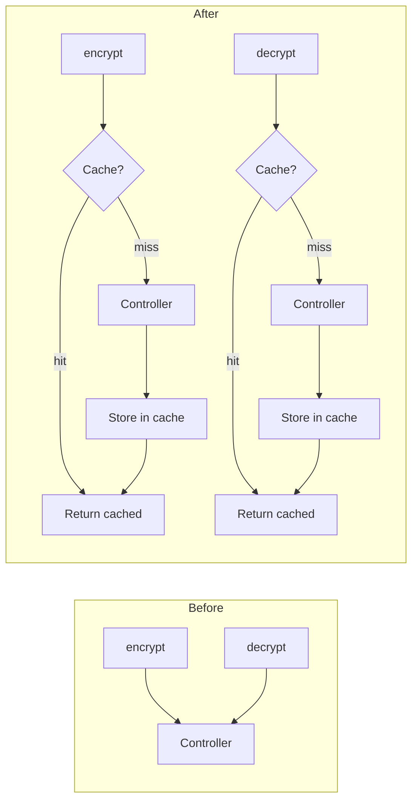

# Reduce controller calls and improve performance (TypeScript SDK)

## Context

The Python client plan [39-reduce_controller_calls_performance](/workspace/aifabrix-miso-client-python/.cursor/plans/39-reduce_controller_calls_performance.plan.md) reduces calls to the miso-controller via encryption response caching and documentation. This plan brings the same performance improvements to the **TypeScript SDK** (aifabrix-miso-client).

Controller rate-limiting (e.g. HTTP 429 on encryption/decryption) is partly driven by call volume. Reducing repeated encrypt/decrypt calls from the client reduces load and improves performance.

---

## Current state: controller calls and caching

| Area                 | Controller calls                                       | Caching in TypeScript SDK                                                                                                                                                                                      |
| -------------------- | ------------------------------------------------------ | -------------------------------------------------------------------------------------------------------------------------------------------------------------------------------------------------------------- |
| **Client token**     | On first use, then refresh on expiry/401               | In-memory in HttpClient; single token reused                                                                                                                                                                   |
| **Token validation** | POST `/api/v1/auth/validate`                           | Cached in [AuthService](src/services/auth.service.ts) via [CacheService](src/services/cache.service.ts) (token hash, smart TTL from `tokenValidationTTL` / token exp)                                          |
| **User info**        | From validate or GET user                              | Cached by `user:{userId}`, `userTTL` (default 300s) in AuthService                                                                                                                                             |
| **Roles**            | GET `/api/v1/auth/roles`                               | Cache-first in [RoleService](src/services/role.service.ts) by `roles:{userId}`, `roleTTL` (900s)                                                                                                               |
| **Permissions**      | GET `/api/v1/auth/permissions`                         | Cache-first in [PermissionService](src/services/permission.service.ts) by `permissions:{userId}`, `permissionTTL` (900s)                                                                                       |
| **Token exchange**   | POST `/api/v1/auth/token/exchange`                     | **No caching** (call every time)                                                                                                                                                                               |
| **Encryption**       | POST `/api/security/parameters/encrypt` and `/decrypt` | **No caching** — every encrypt/decrypt = one controller call                                                                                                                                                   |
| **Logs**             | POST `/api/v1/logs` or batch                           | [LoggerService](src/services/logger/logger.service.ts): when `audit.batchSize` or `audit.batchInterval` is set, audit logs go to [AuditLogQueue](src/utils/audit-log-queue.ts) and are sent via batch endpoint |

**Main gap:** Encryption has no caching. Repeated per-item encrypt/decrypt (e.g. in upload or bulk flows) can generate high call volume.

---

## Proposed changes

### 1. Add encryption response caching (high impact)

**Goal:** Avoid repeated controller calls when the same value is encrypted or decrypted multiple times (same parameter name + same plaintext/ciphertext).

- **Decrypt cache**
  - Key: derived from `(value, parameterName)` (value = encrypted reference string). Use a hash for the cache key, e.g. `encryption:decrypt:${hash(value + parameterName)}`.
  - Same ciphertext + same parameter → same plaintext; cache the plaintext.
  - Use [CacheService](src/services/cache.service.ts) (Redis + in-memory fallback).
  - TTL: configurable `encryptionCacheTTL` (seconds), default 300. Use 0 to disable.
- **Encrypt cache**
  - Key: **hash** of `(plaintext, parameterName)` (e.g. SHA-256 via `crypto.createHash('sha256')`). Never use raw plaintext in the key.
  - Same input → same `EncryptResult`; cache the result.
  - Same TTL as decrypt.
- **Implementation**
  - [EncryptionService](src/services/encryption.service.ts): add optional `CacheService` and `encryptionCacheTTL` (seconds); before calling controller, check cache; on success, store in cache with TTL.
  - On controller or validation errors: **do not cache**.
  - [MisoClient](src/miso-client.ts): construct `EncryptionService` with `this.cacheService` and `this.config.cache?.encryptionCacheTTL ?? 300` (or 0 to disable when not set — decide default in impl).
  - [Config](src/types/config.types.ts): add `cache.encryptionCacheTTL?: number` (seconds, 0 = disabled).
- **Safety**
  - Document that with key rotation, cache may serve stale results until TTL expires; recommend lower TTL or disabling cache when rotation is frequent.
  - Optional: add `clearEncryptionCache()` on MisoClient or EncryptionService for key-rotation/logout scenarios (can be follow-up).

**Cache key format (examples):**

- Encrypt: `encryption:encrypt:${sha256(plaintext + parameterName)}`
- Decrypt: `encryption:decrypt:${sha256(value + parameterName)}`

Use a stable encoding (e.g. UTF-8) when hashing. If Redis key prefix is configured, CacheService may already prefix keys.

---

### 2. Audit log batching (documentation and optional default)

- **Current behavior:** [LoggerService](src/services/logger/logger.service.ts) creates [AuditLogQueue](src/utils/audit-log-queue.ts) only when `audit.batchSize` or `audit.batchInterval` is set. When set, audit logs are batched and sent via batch endpoint.
- **Action:** Document in "Performance and reducing controller calls" that setting `audit.batchSize` and/or `audit.batchInterval` enables batch logging and reduces log endpoint calls. Mention default batch size/interval (e.g. 10, 100 ms) from [audit-log-queue.ts](src/utils/audit-log-queue.ts).
- **Optional:** Consider enabling the audit queue by default when `audit.enabled !== false` (e.g. create queue with default `batchSize: 10`, `batchInterval: 100` when audit is enabled). This would increase use of batching without breaking existing config. If done, document the change.

---

### 3. Documentation: performance and reducing controller calls

Add or extend a section (e.g. in [docs/](docs/) or [README](README.md)) that:

- Lists which operations are cached: validation, user, roles, permissions, and (after this plan) **encryption**.
- Documents TTLs: `tokenValidationTTL`, `userTTL`, `roleTTL`, `permissionTTL`, `encryptionCacheTTL`, and suggests values for high-throughput (e.g. longer TTLs where consistency allows).
- States that encryption cache can be disabled with `encryptionCacheTTL: 0` and that key rotation may require lower TTL or disabling.
- Recommends enabling Redis for shared cache across processes.
- Explains that audit log batching (via `audit.batchSize` / `audit.batchInterval`) reduces log endpoint calls.

---

### 4. Future / out of scope

- **Token exchange caching:** Python caches by delegated token hash; TypeScript does not. Can be a follow-up plan.
- **Batch encrypt/decrypt:** If the controller adds batch endpoints, the SDK can add batch methods to reduce round-trips. Out of scope here; mention in docs as future work if desired.
- Changes inside miso-controller (rate-limit or batch APIs) are out of scope.

---

## Rules and Standards

This plan must comply with [Project Rules](.cursor/rules/project-rules.mdc). Applicable sections:

- **[Architecture Patterns - Service Layer](.cursor/rules/project-rules.mdc#architecture-patterns)** – EncryptionService receives ApiClient and (new) optional CacheService; cache-first pattern.
- **[Architecture Patterns - Redis Caching Pattern](.cursor/rules/project-rules.mdc#architecture-patterns)** – Cache key format, TTL, fallback to controller when cache miss or unavailable.
- **[Code Style](.cursor/rules/project-rules.mdc#code-style)** – TypeScript strict mode, JSDoc for public methods, try/catch for async, no uncaught throws from service methods.
- **[Testing Conventions](.cursor/rules/project-rules.mdc#testing-conventions)** – Test file `tests/unit/services/encryption.service.test.ts`; mock ApiClient and CacheService; test success and error paths; cache hit/miss; ≥80% branch coverage for new code.
- **[Configuration](.cursor/rules/project-rules.mdc#configuration)** – Config in `src/types/config.types.ts`; optional `encryptionCacheTTL` under `cache`.
- **[Security Guidelines](.cursor/rules/project-rules.mdc#security-guidelines)** – No plaintext in cache keys; encrypt key = hash(plaintext, parameterName); no logging of plaintext/secrets.
- **[Performance Guidelines](.cursor/rules/project-rules.mdc#performance-guidelines)** – Use cache when available; fallback to controller; handle cache/Redis failures gracefully.
- **[Code Size Guidelines](.cursor/rules/project-rules.mdc#code-size-guidelines)** – Files ≤500 lines, methods ≤20–30 lines; split or extract helpers if needed.
- **[When Adding New Features](.cursor/rules/project-rules.mdc#when-adding-new-features)** – Update types first, then service, tests, docs.

**Key requirements**

- EncryptionService: optional CacheService; cache key for decrypt from (value, parameterName); for encrypt use hash of (plaintext, parameterName). On controller or validation errors, do not cache.
- All new/updated code: type hints, JSDoc for public methods; try/catch in async paths.
- Tests: Jest; mock ApiClient and CacheService; cover cache hit, miss, TTL, disabled, controller error (no cache write), and optional “no CacheService” behavior.

---

## Before Development

- [ ] Read Architecture Patterns and Redis Caching Pattern in [project-rules.mdc](.cursor/rules/project-rules.mdc).
- [ ] Review [RoleService](src/services/role.service.ts) / [PermissionService](src/services/permission.service.ts) cache-first pattern and [CacheService](src/services/cache.service.ts) API (`get`, `set`, TTL).
- [ ] Review [EncryptionService](src/services/encryption.service.ts) and [encryption.service.test.ts](tests/unit/services/encryption.service.test.ts) for integration points and existing coverage.
- [ ] Confirm config shape in [MisoClientConfig](src/types/config.types.ts) for optional `cache.encryptionCacheTTL`.

---

## Definition of done

1. **Build:** Run `pnpm run build` first (must succeed – TypeScript compilation).
2. **Lint:** Run `pnpm run lint` (must pass with zero errors/warnings).
3. **Test:** Run `pnpm test` after lint (all tests must pass; ≥80% coverage for new code).
4. **Validation order:** BUILD → LINT → TEST (mandatory sequence; do not skip steps).
5. **Config:** `config.cache.encryptionCacheTTL` added (seconds, 0 = disabled); default chosen and documented.
6. **EncryptionService:** Optional CacheService and TTL; cache lookup before controller call; cache write on success only; encrypt key = hash(plaintext, parameterName); decrypt key = hash(value, parameterName); no cache on controller or validation errors.
7. **MisoClient:** Pass CacheService and encryptionCacheTTL into EncryptionService constructor.
8. **Tests:** All encryption cache test cases from “Test requirements” below implemented; mocks for ApiClient and CacheService; existing encrypt/decrypt tests still pass.
9. **No regression:** When cache is disabled or not configured, existing encrypt/decrypt behavior unchanged.
10. **Documentation:** “Performance and reducing controller calls” (or equivalent) added/updated with cached operations, TTLs, and audit log batching.
11. **File size:** New/updated files ≤500 lines; methods ≤20–30 lines.
12. **JSDoc:** All new or changed public methods have JSDoc with parameters and return types.

### Test requirements (encryption cache)

Add the following tests in `tests/unit/services/encryption.service.test.ts` (or equivalent). Mock `ApiClient` and `CacheService`; use `CacheService.get` / `CacheService.set` with `jest.fn()` to assert behavior.

| # | Scenario | What to verify |
|---|----------|----------------|
| 1 | **Encrypt cache miss** | First encrypt(plaintext, param) calls API and `cache.set` with correct TTL; returns API result. |
| 2 | **Encrypt cache hit** | After a successful encrypt, second encrypt(same plaintext, same param) returns cached result; API not called again. |
| 3 | **Decrypt cache miss** | First decrypt(value, param) calls API and `cache.set` with correct TTL; returns API plaintext. |
| 4 | **Decrypt cache hit** | After a successful decrypt, second decrypt(same value, same param) returns cached plaintext; API not called again. |
| 5 | **TTL** | When encryptionCacheTTL is set (e.g. 300), `cache.set` is invoked with that TTL (in seconds). |
| 6 | **Cache disabled (TTL 0)** | When encryptionCacheTTL is 0, no `cache.get` or `cache.set`; API called every time. |
| 7 | **No CacheService** | When CacheService is not provided (undefined), no cache read/write; API called every time (same as current behavior). |
| 8 | **Controller error – no cache** | When encrypt or decrypt API throws, `cache.set` is not called. |
| 9 | **Validation error – no cache** | When validation fails (e.g. invalid parameter name) before any API call, no `cache.get` or `cache.set`. |

Optional: assert cache key shape (e.g. prefix `encryption:encrypt:`, `encryption:decrypt:`) and that encrypt key is not plaintext. Ensure existing tests for key validation, API propagation, and parameter names still pass.

---

## Summary diagram

---

## Validation

**Date**: 2026-03-07  
**Status**: ✅ COMPLETE

### Executive Summary

Implementation for plan 55 (Reduce controller calls and improve performance) is complete. All Definition of Done criteria are met: encryption response caching is implemented in `EncryptionService` with configurable TTL and CacheService integration; config, MisoClient wiring, documentation, and 9 encryption-cache test scenarios are in place. Build, lint, and full test suite pass.

### File Existence Validation

- ✅ `src/services/encryption.service.ts` – CacheService and encryptionCacheTTL in constructor; buildCacheKey (SHA-256); cache get/set on encrypt/decrypt; no cache on validation or API errors.
- ✅ `src/types/config.types.ts` – `cache.encryptionCacheTTL?: number` with JSDoc (0 = disabled, default 300).
- ✅ `src/miso-client.ts` – EncryptionService constructed with `this.cacheService` and `this.config.cache?.encryptionCacheTTL ?? 300`.
- ✅ `tests/unit/services/encryption.service.test.ts` – `describe('encryption cache')` with 9 scenarios; createMockCache; cache key shape asserted (`encryption:encrypt:`, `encryption:decrypt:` + 64-char hex).
- ✅ `docs/redis.md` – Cached operations (including encryption), TTLs, "Performance and reducing controller calls", encryption cache disable, audit log batching.
- ✅ `docs/configuration.md` – Optional cache TTL example includes `encryptionCacheTTL`; link to redis.md.
- ✅ `docs/audit-and-logging.md` – Batching subsection for `audit.batchSize` / `audit.batchInterval` and link to redis.md.

### Test Coverage

- ✅ Unit tests exist for encryption cache: `tests/unit/services/encryption.service.test.ts` – 9 scenarios (encrypt/decrypt cache miss/hit, TTL, cache disabled, no CacheService, controller error no cache, validation error no cache); cache key format asserted.
- ✅ Encryption service test file: 60 tests total (existing + cache); full suite: 69 test suites, 1901 tests passed.

### Code Quality Validation

- **STEP 1 - FORMAT**: ✅ PASSED (`pnpm run lint:fix`, exit code 0)
- **STEP 2 - LINT**: ✅ PASSED (`pnpm run lint`, exit code 0, 0 errors, 0 warnings)
- **STEP 3 - TEST**: ✅ PASSED (`pnpm test` – 69 suites, 1901 tests passed)
- **Build**: ✅ PASSED (`pnpm run build`)

### Cursor Rules Compliance

- ✅ Code reuse: CacheService and buildCacheKey used; no duplication.
- ✅ Error handling: No cache write on controller or validation errors; encrypt/decrypt throw on error.
- ✅ Logging: No plaintext/secrets in cache keys or logs.
- ✅ Type safety: TypeScript strict; EncryptResult interface; CacheService typed.
- ✅ Async patterns: async/await in encrypt/decrypt and tests.
- ✅ HTTP client patterns: EncryptionService uses ApiClient (encryption API); no direct HTTP in service.
- ✅ Token management: N/A for encryption service.
- ✅ Redis/cache: Cache key hash only; TTL from config; cache optional (null/0 = disabled).
- ✅ Service layer: EncryptionService receives ApiClient and optional CacheService; cache-first pattern.
- ✅ Security: Encrypt key = hash(plaintext + parameterName); no plaintext in keys.
- ✅ Public API naming: camelCase (encryptionCacheTTL, EncryptResult, etc.).

### Implementation Completeness

- ✅ Services: EncryptionService cache logic and constructor params complete.
- ✅ Types: `cache.encryptionCacheTTL` in config.types.ts.
- ✅ Utilities: buildCacheKey in encryption.service.ts.
- ✅ Express utilities: N/A for this plan.
- ✅ Documentation: redis.md, configuration.md, audit-and-logging.md updated.
- ✅ Exports: No new public exports; EncryptionService used internally by MisoClient.

### Issues and Recommendations

- None. Optional follow-up: `clearEncryptionCache()` for key-rotation/logout (already noted in plan).

### Final Validation Checklist

- [x] All DoD criteria met
- [x] All mentioned files exist and contain expected implementation
- [x] Encryption cache tests (9 scenarios) implemented and passing
- [x] Code quality (format, lint, build, test) passes
- [x] Cursor rules compliance verified
- [x] Implementation complete

**Result**: ✅ **VALIDATION PASSED** – Plan 55 implementation is complete; encryption response caching, config, wiring, docs, and tests are in place and all checks pass.

