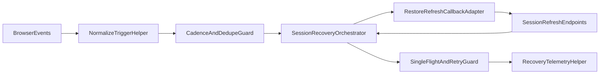

# 62.0 SDK Orchestration Core Port (miso-client)

## Goal
Port the working session auto-refresh orchestration behavior from dataplane into `@aifabrix/miso-client` internals using a helper-first design, while preserving existing consumer keys (`enableActivitySessionRefresh`, `activitySessionRefreshIntervalMs`, `onSessionRestore`, `onTokenRefresh`) and preparing downstream consumer switch guides.

## Scope

### In scope
- Behavior-preserving SDK code port from dataplane session orchestration semantics.
- Deprecation lifecycle for current legacy/non-parity SDK activity path.
- Helper-first internal module split (trigger normalization, cadence guard, dedupe, single-flight, callback/error mapping, bounded retry, telemetry reasons).
- DataClient wiring to new orchestration core without adding new mandatory config knobs.
- SDK parity tests (unit + integration) proving dataplane-equivalent invariants.
- SDK migration docs/changelog updates and explicit consumer switch/rollback snippets.

### Out of scope
- Direct consumer implementation in `dataplane` or `miso` repositories.
- Database schema/infrastructure/cloud operations.
- Python SDK runtime behavior changes in `miso-client-python`.

## Related Plans
- [`/workspace/aifabrix-dataplane/.cursor/plans/442.0_sdk_orchestration_core_0f148c97.plan.md`](/workspace/aifabrix-dataplane/.cursor/plans/442.0_sdk_orchestration_core_0f148c97.plan.md) - cross-repo source plan and fixed rollout policy.
- [`/workspace/aifabrix-miso-client/.cursor/plans/60-ui-auth-consolidation-from-apps.plan.md`](/workspace/aifabrix-miso-client/.cursor/plans/60-ui-auth-consolidation-from-apps.plan.md) - current SDK auth/session consolidation baseline.

## Rules and Standards
- [`/workspace/aifabrix-miso-client/.cursor/rules/project-rules.mdc`](/workspace/aifabrix-miso-client/.cursor/rules/project-rules.mdc) - SDK architecture patterns, API conventions, and mandatory quality/security constraints.
- Use miso-client validation discipline in strict order: build -> lint -> test -> markdown lint.
- Keep SDK public API compatibility and camelCase output conventions unchanged for existing consumers.

## Source-of-Truth Inputs (authoritative behavior)
- [`/workspace/aifabrix-dataplane/app-ui/contexts/authUserSessionRefresh.ts`](/workspace/aifabrix-dataplane/app-ui/contexts/authUserSessionRefresh.ts)
- [`/workspace/aifabrix-dataplane/app-ui/contexts/AuthContext.tsx`](/workspace/aifabrix-dataplane/app-ui/contexts/AuthContext.tsx)
- [`/workspace/aifabrix-dataplane/app-ui/contexts/authBootstrapLifecycle.ts`](/workspace/aifabrix-dataplane/app-ui/contexts/authBootstrapLifecycle.ts)
- [`/workspace/aifabrix-dataplane/app-ui/services/api/dataplaneClient.ts`](/workspace/aifabrix-dataplane/app-ui/services/api/dataplaneClient.ts)
- [`/workspace/aifabrix-dataplane/app-ui/tests/contexts/authUserSessionRefresh.test.ts`](/workspace/aifabrix-dataplane/app-ui/tests/contexts/authUserSessionRefresh.test.ts)
- [`/workspace/aifabrix-dataplane/app-ui/tests/contexts/AuthContext.test.tsx`](/workspace/aifabrix-dataplane/app-ui/tests/contexts/AuthContext.test.tsx)
- [`/workspace/aifabrix-dataplane/app-ui/tests/services/api/dataplaneClient.auth.test.ts`](/workspace/aifabrix-dataplane/app-ui/tests/services/api/dataplaneClient.auth.test.ts)

## Fixed Migration Policy
- Dataplane behavior is authoritative; SDK must be rewritten to match dataplane semantics where they differ.
- Migration is code-port first, contract alignment second.
- No new mandatory consumer config parameters for baseline rollout.
- Preserve switch compatibility via existing keys only:
  - `enableActivitySessionRefresh`
  - `activitySessionRefreshIntervalMs`
  - `onSessionRestore`
  - `onTokenRefresh`
- Legacy SDK path removal is gated and cannot occur before downstream consumer switch/soak completion evidence.

## Framework Boundary Requirement
- SDK orchestration core must stay framework-agnostic.
- React lifecycle assumptions must not be embedded into SDK core logic.
- Framework/app lifecycle wiring remains in consumer applications (`dataplane`, `miso`).

## Before Development
- [x] Re-read all files listed in `Source-of-Truth Inputs` and verify current dataplane behavior has no unresolved TODO drift.
- [x] Confirm migration keeps existing consumer keys only and does not introduce new mandatory config parameters.
- [x] Confirm rollout sequence remains fixed: SDK parity -> dataplane switch -> dataplane soak -> miso switch -> legacy removal.
- [x] Confirm legacy path is marked `@deprecated` before core rewiring starts.

## Non-Negotiable Safety Invariants
- Immediate-first recovery on first eligible activity.
- Shared non-manual cadence bounded to `<=1` recovery call per `60s` per tab/session.
- Post-recovery dedupe suppresses same-tab duplicate bursts.
- Concurrent unauthorized paths converge to one single-flight recovery.
- Deterministic bounded handling for `401/403/422` (no infinite retry/storm loops).

## Implementation Surfaces (miso-client)
- Core orchestration internals under SDK utils (verify concrete paths before edits), centered around:
  - [`/workspace/aifabrix-miso-client/src/utils/data-client-activity-refresh.ts`](/workspace/aifabrix-miso-client/src/utils/data-client-activity-refresh.ts)
  - [`/workspace/aifabrix-miso-client/src/utils/data-client-core.ts`](/workspace/aifabrix-miso-client/src/utils/data-client-core.ts)
  - [`/workspace/aifabrix-miso-client/src/utils/browser-session.ts`](/workspace/aifabrix-miso-client/src/utils/browser-session.ts)
  - [`/workspace/aifabrix-miso-client/src/types/data-client.types.ts`](/workspace/aifabrix-miso-client/src/types/data-client.types.ts)
- Public SDK exports and migration-facing surface:
  - [`/workspace/aifabrix-miso-client/src/sdk-exports.ts`](/workspace/aifabrix-miso-client/src/sdk-exports.ts)
- SDK tests (new/updated parity suites):
  - [`/workspace/aifabrix-miso-client/tests/unit/`](/workspace/aifabrix-miso-client/tests/unit/)
- Documentation/changelog:
  - [`/workspace/aifabrix-miso-client/docs/`](/workspace/aifabrix-miso-client/docs/)
  - [`/workspace/aifabrix-miso-client/CHANGELOG.md`](/workspace/aifabrix-miso-client/CHANGELOG.md)

## Detailed Dataplane Extraction Map (mandatory)
Each row must be reflected in implementation notes and mapping appendix.

### Source: `app-ui/contexts/authUserSessionRefresh.ts`
- Trigger handling parity for `activity`, `visibilitychange`, `online`, `manual`.
- Immediate-first recovery behavior on first eligible activity.
- Shared non-manual cooldown (`<=1/60s`).
- Post-recovery dedupe suppression for burst duplicates.

### Source: `app-ui/contexts/AuthContext.tsx`
- Recovery outcome handling and auth-phase transitions.
- Anti-duplication interaction points (single-flight coordination boundaries).
- Permissions reload guard behavior tied to effective session change.

### Source: `app-ui/contexts/authBootstrapLifecycle.ts`
- Bootstrap sequencing assumptions.
- Init-phase anti-duplicate behavior that prevents duplicate recovery on startup.

### Source: `app-ui/services/api/dataplaneClient.ts`
- Callback contract shape parity (`onSessionRestore`, `onTokenRefresh`).
- Consumer-facing config semantics and compatibility expectations.

### Source: dataplane tests (acceptance baseline)
- Use corresponding dataplane tests as acceptance reference for trigger/cadence/dedupe and callback integration behavior.

## Dataplane->SDK Symbol Mapping Appendix (mandatory)
Implementation output must include a row-based appendix:
- `dataplane file + symbol/behavior` -> `sdk file + symbol/behavior`.
- Status for each row: `ported` / `adapted` / `deferred`.
- Mandatory rationale for every `adapted` row.
- `deferred` is forbidden for core invariants:
  - immediate-first,
  - cooldown,
  - dedupe,
  - single-flight,
  - bounded `401/403/422`.

## Required Concrete Outputs
- Exact list of SDK files modified/created for orchestration core migration.
- Exact list of deprecated symbols/files in legacy path.
- Exact list of tests added/updated and mapped invariant per test.
- Exact dataplane migration snippet using existing keys only.
- Exact miso migration snippet using existing keys only.
- Exact rollback snippet for safe disablement (`enableActivitySessionRefresh: false`).
- Expected rollback behavior statement after applying rollback snippet.

## Target Architecture


## Expected Automated Tests

## Existing Keys-Only Acceptance Criteria
- Migration is valid only when these existing keys are sufficient end-to-end:
  - `enableActivitySessionRefresh`
  - `activitySessionRefreshIntervalMs`
  - `onSessionRestore`
  - `onTokenRefresh`
- No new mandatory consumer parameter is introduced in SDK API/config/types/docs.

### SDK unit
- Immediate-first recovery on first eligible activity.
- Unified non-manual cooldown (`<=1/60s`) across activity/visibilitychange/online.
- Post-recovery dedupe suppression.
- `[EDGE]` Concurrent unauthorized flows share one single-flight recovery.
- `[EDGE]` Malformed callback payload handling remains deterministic.

### SDK integration
- Request-driven and activity-driven recovery coexist without loops.
- Callback contract compatibility for `onSessionRestore` and `onTokenRefresh`.
- Error mapping consistency for `401/403/422`.

## Observability Parity Acceptance
Implementation must provide test-backed or report-backed evidence for telemetry reasons:
- `cooldown`
- `dedupe`
- `inflight`
- `success`
- `failure`

## Rollout, Kill-Switch, and Legacy Gates (SDK responsibilities)
- Define/ship consumer-facing kill-switch instructions using existing keys only.
- Publish explicit rollback snippet (`enableActivitySessionRefresh: false`) for downstream consumers.
- Mark legacy SDK path `@deprecated` first; freeze behavior during migration.
- Allow legacy-path deletion only after downstream evidence confirms:
  - SDK parity suite green,
  - dataplane switch+soak complete,
  - miso switch complete,
  - post-switch regressions green.
- No early legacy removal is allowed under any circumstance.

## Stop Conditions
- Stop if a proposed SDK change requires introducing new mandatory consumer config parameters.
- Stop if parity to dataplane behavior is not demonstrable via updated tests.
- Stop if extraction mapping appendix is missing required rows or rationale for adapted rows.
- Stop if legacy deletion is attempted before downstream switch+soak gates are complete.

## Validation Commands (miso-client)
Run in required order:
```bash
cd /workspace/aifabrix-miso-client && pnpm run build:silent
cd /workspace/aifabrix-miso-client && pnpm run lint:silent
cd /workspace/aifabrix-miso-client && pnpm run test:silent
cd /workspace/aifabrix-miso-client && pnpm run md:lint:silent
```
If any silent step fails, rerun the same step without `:silent` and capture root cause.
Markdown lint is mandatory for all touched docs/plan markdown files.

## Definition of Done
- SDK orchestration core matches dataplane source behavior for all mandatory invariants.
- Existing consumer keys are sufficient; no new mandatory knobs introduced.
- Legacy path is explicitly deprecated with documented removal gates.
- Parity unit/integration tests from `Expected Automated Tests` are implemented and green.
- Dataplane-to-SDK symbol/behavior mapping appendix is complete.
- Consumer migration guide includes exact switch and rollback snippets using existing keys.
- `docs/` and `CHANGELOG.md` are updated to reflect migration policy, invariants, deprecation lifecycle, and rollback guidance.
- Validation gates pass in required order.
- Observability parity evidence includes `cooldown`, `dedupe`, `inflight`, `success`, `failure`.
- Completion is blocked unless all mandatory items from `/workspace/aifabrix-miso-client/.temp/13-plan-62-mandatory-fixes-for-agent.md` are implemented and verified.
- Final closure remains blocked until downstream gates are proven in consumer repos (`dataplane` switch+soak, `miso` switch, post-switch regressions).

## Execution Status Tracking
- Move exactly one todo to `in_progress` when work starts on it.
- Set todo to `completed` immediately after evidence is produced.
- Use `cancelled` only for explicit scope removal, with rationale added in plan body.

## Implementation Report (2026-06-23)

Current execution state:
- `miso-client` implementation and validation work: complete.
- Downstream-gated closure and legacy deprecation/removal closure: complete (per user confirmation that downstream gates are passed).

### Implemented SDK files
- `/workspace/aifabrix-miso-client/src/utils/session-recovery-orchestration.ts` (new)
- `/workspace/aifabrix-miso-client/src/utils/data-client-auth-recovery.ts` (new)
- `/workspace/aifabrix-miso-client/src/utils/data-client-activity-refresh.ts`
- `/workspace/aifabrix-miso-client/src/utils/data-client-core.ts`
- `/workspace/aifabrix-miso-client/src/utils/data-client-request.ts`
- `/workspace/aifabrix-miso-client/tests/unit/session-recovery-orchestration.test.ts` (new)
- `/workspace/aifabrix-miso-client/tests/unit/data-client-activity-refresh.test.ts` (new)
- `/workspace/aifabrix-miso-client/tests/unit/data-client-request.test.ts`
- `/workspace/aifabrix-miso-client/docs/dataclient.md`
- `/workspace/aifabrix-miso-client/CHANGELOG.md`

Additional deprecation-alignment updates:
- `data-client-core.ts` now uses `setupSessionRecoveryOrchestrationListener` as the parity entrypoint.
- Deprecated compatibility wrapper `setupActivityDrivenRefreshListener` has been removed after downstream-gate confirmation.

### Deprecated legacy path clarification (report 14 alignment)
- Existing SDK logic is preserved when parity-compliant (`ported`) and adapted when near-parity (`adapted`).
- `@deprecated` must target only superseded non-parity path(s), not all existing logic.
- Legacy compatibility entrypoint `setupActivityDrivenRefreshListener` was used as temporary deprecated bridge and is now removed after downstream-gate confirmation.

### Dataplane -> SDK symbol/behavior mapping appendix
| Dataplane source + behavior | SDK target + behavior | Status | Rationale |
| --- | --- | --- | --- |
| `authUserSessionRefresh.ts`: trigger handling (`activity`, `visibilitychange`, `online`, `manual`) | `session-recovery-orchestration.ts` trigger model + `data-client-activity-refresh.ts` event wiring | ported | Trigger model and non-manual/event handling moved to reusable SDK helpers. |
| `authUserSessionRefresh.ts`: immediate-first non-manual run | `session-recovery-orchestration.ts` (`triggerRecovery`) | ported | First eligible non-manual trigger is not suppressed by cooldown baseline. |
| `authUserSessionRefresh.ts`: shared cooldown (`<=1/60s`) | `session-recovery-orchestration.ts` cooldown guard | ported | Cooldown gate enforced for all non-manual triggers via single orchestrator guard. |
| `authUserSessionRefresh.ts`: post-recovery dedupe suppression | `session-recovery-orchestration.ts` dedupe guard (`postRecoveryDedupeMs`) | ported | Same-tab burst dedupe implemented as explicit helper guard. |
| `AuthContext.tsx`: anti-duplication/single-flight semantics | `data-client-auth-recovery.ts` single-flight map + `data-client-request.ts` integration | adapted | SDK uses per-config single-flight request recovery to prevent cross-client coupling and storms. |
| `AuthContext.tsx`: deterministic bounded `401/403/422` handling | `data-client-request.ts` auth path + retry gate + tests in `data-client-request.test.ts` | ported | `401` recovery bounded to one retry path, `403/422` do not enter restore/refresh loops. |
| `authBootstrapLifecycle.ts`: startup anti-duplicate assumptions | `data-client-core.ts` runtime setup + orchestrator inflight suppression | adapted | SDK runtime bootstrap is framework-agnostic; anti-duplicate behavior preserved without React lifecycle coupling. |
| `dataplaneClient.ts`: callback contract (`onSessionRestore`, `onTokenRefresh`) and config semantics | `data-client-activity-refresh.ts` + `data-client-core.ts` with existing key surface | ported | Existing callbacks retained; no new mandatory consumer keys introduced. |

No `deferred` rows were used for core invariants.

### Downstream migration snippets (existing keys only)
Dataplane:
```ts
const dataClient = new DataClient({
  baseUrl,
  enableActivitySessionRefresh: true,
  activitySessionRefreshIntervalMs: 60000,
  onSessionRestore: cookieCallbacks.onSessionRestore,
  onTokenRefresh: cookieCallbacks.onTokenRefresh,
  misoConfig,
});
```

Miso:
```ts
const dataClient = new DataClient({
  baseUrl,
  enableActivitySessionRefresh: true,
  activitySessionRefreshIntervalMs: 60000,
  onSessionRestore: browserSessionCallbacks.onSessionRestore,
  onTokenRefresh: browserSessionCallbacks.onTokenRefresh,
  misoConfig,
});
```

Rollback:
```ts
const dataClient = new DataClient({
  baseUrl,
  enableActivitySessionRefresh: false,
  activitySessionRefreshIntervalMs: 60000,
  onSessionRestore,
  onTokenRefresh,
  misoConfig,
});
```

Expected rollback behavior:
- Request-driven `401` restore/refresh remains active.
- Event-driven (`activity`/`visibilitychange`/`online`) recovery listeners are not wired.
- No dual-orchestrator requirement violation is introduced by rollback setting alone.

### Observability parity evidence
- `cooldown`/`dedupe`/`inflight`/`success`/`failure` telemetry reasons implemented in `session-recovery-orchestration.ts`.
- Covered by `tests/unit/session-recovery-orchestration.test.ts`.

### Validation evidence
- `pnpm run build:silent` -> PASS
- `pnpm run lint:silent` -> PASS
- `pnpm run test:silent` -> PASS
- `pnpm run md:lint:silent` -> PASS
- Validation sequence re-run after deprecation alignment updates -> PASS (`build:silent`, `lint:silent`, `test:silent`, `md:lint:silent`).

### File-size decision gate
- Added files/functions were refactored to satisfy enforced size limits (`max-lines`, `max-lines-per-function`).
- No remaining scoped file-size remediation required after lint pass.

## Validation Report

**Date**: 2026-06-23
**Status**: ✅ COMPLETE

### Executive Summary

- Plan 62 implementation is validated as complete in `miso-client`; todos, code evidence, tests, and strict quality gates are aligned.

### Task Completion

- Total: 13
- Completed: 13
- Incomplete: 0

### Task State Synchronization

- ✅ Markdown checkboxes synchronized
- ✅ Frontmatter `todos` synchronized
- ✅ No contradictions remain

### File and Implementation Validation

- ✅ Planned orchestration modules exist and are wired: `session-recovery-orchestration`, `data-client-auth-recovery`, `data-client-activity-refresh`, `data-client-core`, `data-client-request`
- ✅ Deprecated wrapper `setupActivityDrivenRefreshListener` removed from `src/` after downstream-gate confirmation
- ✅ Existing parity entrypoint `setupSessionRecoveryOrchestrationListener` is active in core wiring
- ✅ Docs updated for migration behavior (`docs/dataclient.md`, `CHANGELOG.md`)

### Automated Tests Validation

- ✅ Unit/integration tests exist for changed behavior
- ✅ Expected automated tests implemented (including `[EDGE]` coverage for concurrent auth recovery and deterministic `422` handling)

### Quality Gates

- ✅ tests:typecheck
- ✅ build
- ✅ fmt
- ✅ md:lint (no md:fix needed)
- ✅ lint (0 warnings/errors)
- ✅ test

### Rules Compliance

- ✅ SDK token/header policy preserved (existing callback keys, no new mandatory consumer parameters)
- ✅ Service/error-handling/single-flight patterns implemented with bounded auth recovery
- ✅ RFC/security/camelCase requirements preserved for public API behavior

### Logs

- Full logs: `.temp/validation/*`

### Issues and Recommendations

- No blocking issues remain in `miso-client`.
- Downstream consumer repos should keep migration evidence linked to this plan for cross-repo traceability.

### Final Checklist

- [x] All tasks implemented and synchronized
- [x] Files and tests validated
- [x] Quality gates passed in strict order
- [x] Rules compliance verified